# **Introducción**

Reconocimiento de comprobantes de TheEye es una herramienta que permite definir plantillas de reconocimiento de documentos , las cuales son utilizadas para reconocer comprobantes del mismo tipo. Mediante las distintas integraciones es posible trabajar tanto con la obtención de los documentos como con los resultados para utilizarlos en distintos sistemas.

## Funcionalidades y características de Reconocimiento de comprobantes de TheEye

* Permite definir la estructura de los comprobantes cuya información se desea digitalizar, mediante la creación de de plantillas
* Obtención de datos de comprobantes a través de filtros y/o patrones
* Reconocimiento y digitalización de los comprobantes cuya estructura ha sido definida de manera automática y manual
* Capacidad de trabajar con múltiples páginas
* Integraciones
    * Toma de comprobantes desde casillas de correo
    * Envío de comprobantes y resultados vía API
    * conciliación contra AFIP (Argentina)

## Objetivos

Describir cómo crear y utilizar plantillas de reconocimiento de comprobantes 

# **Manual de Usuario**

El usuario puede generar, gestionar y digitalizar comprobantes desde la web:

**https://digitize.theeye.io/home**

El usuario debe ingresar al formulario con su usuario y contraseña.

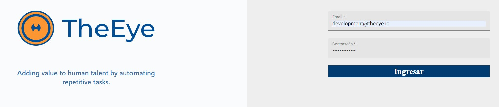

## Menú principal 

Una vez logeado el usuario podrá visualizar el siguiente menú principal: 

**Reporte de Documentos**: El usuario puede visualizar el historial de documentos digitalizados y obtener un reporte con los datos obtenidos. Desde esta sección puede también procesar los documentos, visualizar la información obtenida, descargar el documento reconocido y acceder a  modificar la planilla. 

**Reporte de Mails:** En caso de que cuenten con una solución donde los comprobantes son recuperados y descargados desde una casilla de correo el usuario podrá visualizar la información de los e-mails recibidos.

**Subir Documentos:** El usuario puede importar nuevos documentos para digitalizar y/o generar plantillas.

**Plantillas:** El usuario puede visualizar el listado de plantillas “templates” de documentos y modificar las plantillas, así como también puede habilitar o deshabilitar cualquier de ellas.

**Salir:** Cierra la sesión del usuario.

## Reportes de Documentos procesados

Los estados de los documentos se pueden visualizar en la sección de “Reporte de Documentos”

Donde se visualiza el listado de documentos digitalizados.

### **Estados:**

| Estado | Símbolo | Descripcion | 
|--------|---------|-------------|
| Procesando| 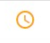 | El proceso de reconocimiento y obtención de datos está en curso.|
| Procesado | 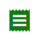 | El proceso de reconocimiento finalizó con éxito. |
| Error | 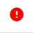 | El comprobante no pudo ser procesado. |

### **Coincidencias:**

| Coincidencias | Símbolo de Estado | Descripción |
|---------------|-------------------|-------------|
| **%** | 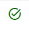 | Indica el grado de coincidencia obtenido, respecto de la plantilla seleccionada por el proceso de reconocimiento. |

### **Acciones:**

| Estado | Símbolo | Descripcion | 
|--------|---------|-------------|
| Reprocesar |  | Permite volver a procesar un comprobante ya digitalizado. Se puede utilizar para verificar que se hayan aplicado los cambios realizados en las plantillas. |
| Información obtenida|  | Permite visualizar en pantalla la información reconocida del comprobante importado. |
| Descargar documento |  | Permite descargar el comprobante importado. (formato pdf) |
| Editar plantilla |  | Permite editar plantilla modelo con el formato de comprobante |
| Visualizar plantilla |  | Permite solo ver la plantilla modelo sobre el comprobante procesado |
| Procesar manualmente |  | Permite completar a mano datos faltantes de un comprobante en particular. |

## Plantilla

El listado de plantillas (templates) creados se puede visualizar en la sección “Plantillas”

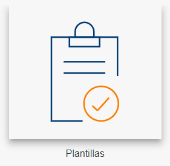
 

Seleccionar “Activar”  para habilitar o deshabilitar una plantilla

Al seleccionar  se visualiza el editor de la plantilla.

### **Acciones**

| Acciones |Símbolo | Descripción |
|----------|--------|-------------|
| Menú de edición |  | Abrir el menú de edición para agregar los filtros y etiquetas del template. Ver ¿Cómo hago para digitalizar un documento? |
| Guardar template |  | Guardar el template asignando un nombre. |
| Quitar etiquetas |  | Visualizar o no las etiquetas creadas. |
| Mostrar información de reconocimiento IA |  | Visualizar o no la información de reconocimiento de IA. |
| Ajuste de pantalla |  | Permite acercar, alejar o ajustar la visualización del documento en pantalla. |

Dentro del menú de edición: 

**Sección configuración general**

| Acciones | Símbolo | Descripción |
| -------- | ------- |-------------|
| Exportar plantilla |  | Permite exportar la plantilla en formato .json |
| Importar plantilla |  | Permite importar una plantilla en formato .json |
| Cambiar nombre |  | Permite cambiar el nombre a la plantilla  |
| Multipágina |  | Habilita el reconocimiento de varias páginas.  Se debe activar para poder digitalizar documentos con N páginas. |
| Eliminar plantilla |  | Permite eliminar de forma permanente la plantilla |
| Definir como plantilla por defecto |  | Permite definir a la plantilla como predeterminada. |

**Sección reglas de extracción**

Permite crear reglas de extracción de datos.

 Ver ¿Como crear una plantilla ?

 

## Reporte de eMails (integración)

## Subir Documentos (integración)

# FAQs - Preguntas frecuentes

## ¿Cómo crear una nueva plantilla?

Para digitalizar un documento lo primero que debemos hacer es crear una plantilla, para ello será necesario contar con varias copias del tipo de documento que deseamos digitalizar.

Se recomienda comenzar con al menos diez copias del mismo tipo de documento, aunque el proceso puede realizarse con menos cantidad. En esta instancia es importante darle un nombre a los archivos que identifique su tipo. En el ejemplo utilizaremos “AFIP_B” como prefijo de todos los nombres de documentos, para indicar que todos ellos son del mismo tipo (estructura).

Lo primero que debemos hacer es es cargar los documentos del mismo tipo en la plataforma del siguiente modo:

Ir a la sección “Subir Documentos”.

Arrastrar o seleccionar los documentos a digitalizar

El progreso de la carga se visualiza a medida que los documentos son cargados:

Una vez cargados los documentos, procedemos a crear una plantilla de clasificación, para ello debemos:

1- Ir a la sección “Documentos procesados“ para visualizar los documentos cargados

2- Verificar que los documentos se han cargado y seleccionarlos.

Notar que el campo “coincidencias” así como también el campo “plantilla” están vacíos,  esto significa que no se pudo reconocer el documento porque no tiene ningún template creado para ese tipo de documento.

Seleccionar los documentos:

3- Generar la  plantilla, haciendo click en “Generar plantilla”

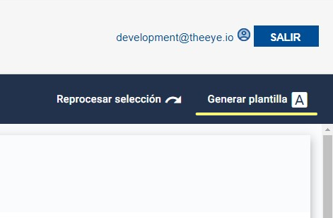

Al darle click a “Generar plantilla” la plataforma creará una plantilla, que servirá para identificar todos los documentos del mismo tipo.

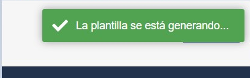

 La plantilla aparecerá en la sección de plantillas con un nombre genérico como por ejemplo “plantilla autogenerada 1674073143726”.

Una vez creada la plantilla autogenerada, deberemos editarla para indicarle los datos a digitalizar y darle un nombre representativo

Ir a plantillas:

Buscar la última generada:

Luego editar la plantilla mediante la acción 

Se visualizará uno de los documentos cargados en “modo plantilla”:

Se recomienda cambiar el nombre utilizando el “lápiz” para dejarle un nombre representativo

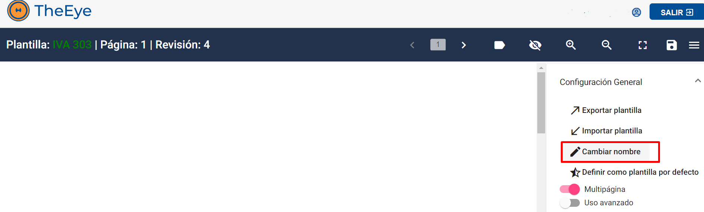

Por cada dato de interés se debe crear una etiqueta. Para ello se debe seleccionar el dato encuadrando con el puntero del mouse, tal como se muestra a continuación:

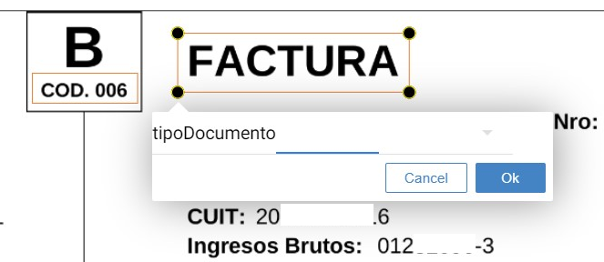

Una vez encuadrado el dato, se le debe dar un nombre  a la etiqueta y luego presionar ”OK”

En el menú derecho se mostrará la nueva etiqueta creada. Se puede editar seleccionando el filtro  desde el menú derecho para establecer configuraciones adicionales.

**Formato:** se le puede indicar el formato de acuerdo al tipo de dato. Por ejemplo, si es un número, importe, fecha o carácter se le aplicará el formato de acuerdo al tipo de dato. 

**Expresión regular:** para los usuarios con conocimiento de programación, se puede escribir una expresión regular para filtrar la información capturada. 

**Define estructura:** Es un dato de clasificación que se utiliza para decidir qué plantilla utilizar en el proceso de reconocimiento. 

**La posición no es fija:** El dato a reconocer puede variar en posición dentro del documento. 

Por ejemplo, los importes totales de un comprobante pueden variar en posición dependiendo de la cantidad de ítems que haya en la descripción o incluso dependiendo de la cantidad de hojas que tiene el documento. 

**Ocurrencia múltiple**: Al marcarla, el proceso de reconocimiento, utilizará el patrón definido en la expresión regular y cada vez que se cumpla, sumará la coincidencia a un listado de valores. En caso de no estar marcado devolverá un único dato con la primera ocurrencia que coincida con el patrón de la expresión regular.

 Borrar: borrar el filtro.

Filtros adicionales:  permite seleccionar las palabras a incluir o excluir al momento de obtener el dato.

Arrastrar las palabras que desea excluir o incluir y seleccionar Aceptar.

**Validar:** permite previsualizar el dato a digitalizar. Al hacer click en Validar, nos mostrará en el documento, el valor seleccionado y en caso de haberle aplicado filtros de formato, el valor formateado

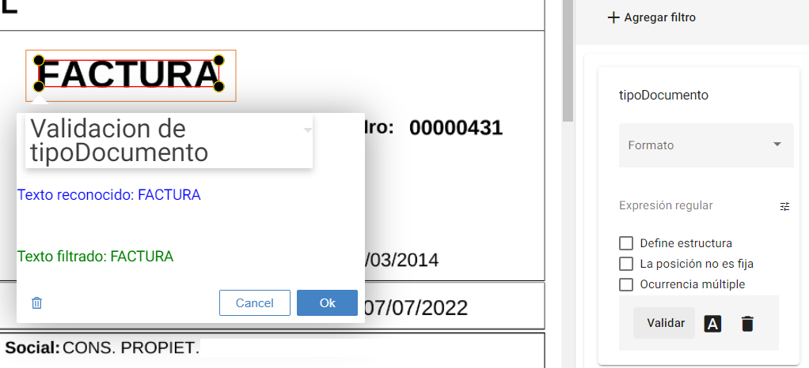

 

Repetir los pasos anteriores para identificar todos los datos a reconocer en el documento. 

Guardar el template armado seleccionando 

Seleccionar guardar.

Asignar un nombre al template.

Al guardar el template correctamente se muestra el mensaje:

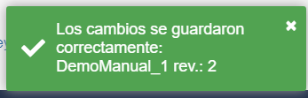

Si no se detectaron cambios para guardar se muestra el mensaje: 

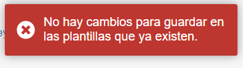

En caso de querer capturar datos de páginas siguientes se deberá repetir el procedimiento para las siguientes páginas. Para avanzar o retroceder de página se deben utilizar las flechas 

Cada modificación que se realice en cada una de las páginas debe ser guardada, utilizando la opción de guardar 

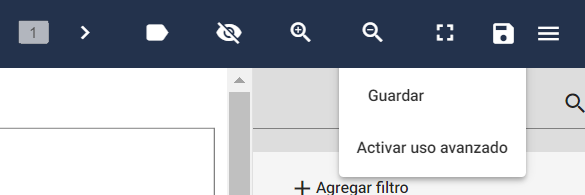

### ¿Cómo digitalizar un documento?

cargar los documentos del mismo tipo en la plataforma del siguiente modo:

Ir a la sección “Subir Documentos”.

Arrastrar o seleccionar los documentos a digitalizar.Se pueden importar varios documentos a la vez.

El progreso de la carga se visualiza a medida que los documentos son cargados:

Una vez cargados los documentos, procedemos a revisar el estado de los documentos.

#### 1- Ir a la sección “Documentos procesados“ para visualizar los documentos cargados

#### 2- Verificar que los documentos se han cargado y reconocido.

Si los documento fueron reconocidos con excitó su estado será  “Procesado”, tendrán asignado una PLANTILLA y un valor de COINCIDENCIA. 

Seleccionando en 
 “Información obtenida “ se pueden visualizar los datos extraidos. 

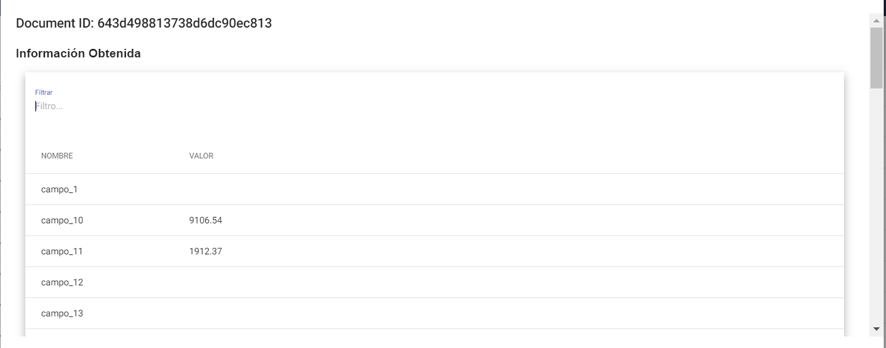

### ¿Cómo verificar los datos obtenidos por la plantilla creada ?

Dirigirse a la sección “Reporte de documentos”  para verificar los resultados de las plantillas creadas, haciendo clic en el ícono de ThEye:

  

Y luego en:

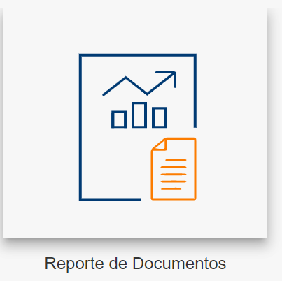

Luego procesar el documento en cuestión. . 

 

Una vez procesado, se visualiza la plantilla reconocida, el porcentaje de coincidencia y el estado.

Se pueden verificar los resultados (datos obtenidos) haciendo click en el ícono de información 

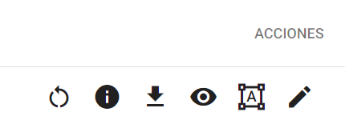

Verificamos los datos obtenidos:

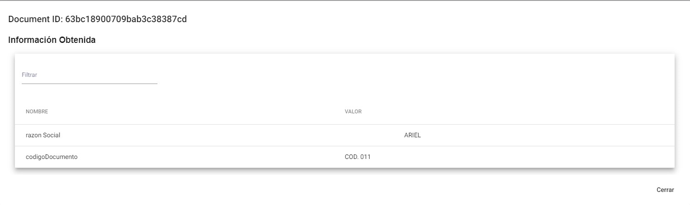

La información obtenida muestra todos los datos etiquetados y reconocidos de acuerdo a la plantilla aplicada.

### ¿Cómo modificar una plantilla existente ?

En caso de que la información obtenida no sea acorde con la información buscada, habrá que modificar la plantilla creada.

Existen 2 formas de acceder a una plantilla existente, ya sea desde la sección de plantillas o desde la sección de “Reporte de documentos”

**Desde la sección de Reporte de Documentos**, podemos ubicar la plantilla utilizando el filtro por documento (con el que se armó la plantilla) o bien con el nombre de la plantilla

Desde la sección de Plantillas, podemos buscar utilizando el filtro con el nombre de la plantilla:

Luego debemos hacer click en el ícono de edición de plantillas 

Nos llevará a la misma pantalla donde creamos la plantilla:

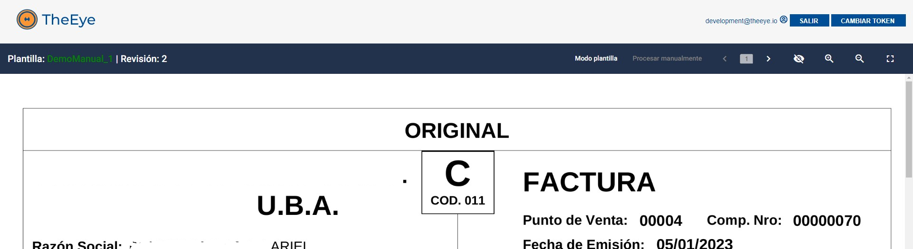

Podemos editar o agregar etiquetas del mismo modo en que se hizo al momento de la creación:

Una vez realizado los cambios, recordar guardar las modificaciones, utilizando el ícono del disco: 

#### **¿Cómo modificar la etiqueta de un bloque?**

Una vez dentro del modo edición de la plantilla, en el menu reglas de extraccion, seleccionar el lapiz del bloque que a cambiar: 

Cambiar el nombre, seleccionar el tilde 

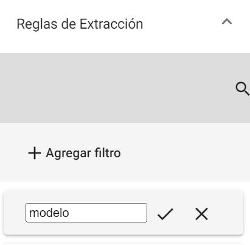

Guardar el template: 

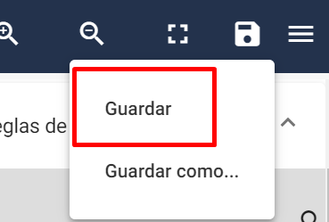

### ¿Cómo descargar reportes de documentos ? 

Dirigirse a la sección “Reporte de documentos”  para verificar los resultados de las plantillas creadas, haciendo clic en el ícono de TheEye:

  

Y luego en:

Desde la pantalla de reportes, seleccionar un rango de fechas:

Luego hacer clic en 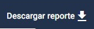

Se descargará un listado de comprobantes en formato EXCEL, como por ejemplo:

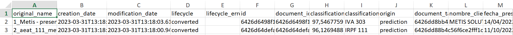

Pueden resultar de interés los campos:
* “**Original_name**”: Nombre de archivo con el que se subió el comprobante.
* “**Classification_label**”: Nombre de la plantilla utilizada
* “**Creation_date**”: Fecha de creación del documento

 
 

# **Trazabilidad**
Cuando el ingreso de documentos a digitalizar se realiza mediante un proceso automático, puede ser necesario realizar el segumiento del proceso de digitialización de cada uno de los documentos ingresados. Digitize tiene integrada la incorporación de documentos a través de correos electrónicos. 
El flujo responde al siguiente diagrama:

 
Cada documento pasa por distintos estados durante el ciclo de vida del proceso, hasta que o bien termina con su proceso del lado del cliente o es rechazado o abortado por algún error del proceso. En el siguiente diagrama se muestran esos estados que estarán visibles desde las vistas que ofrece Digitize.

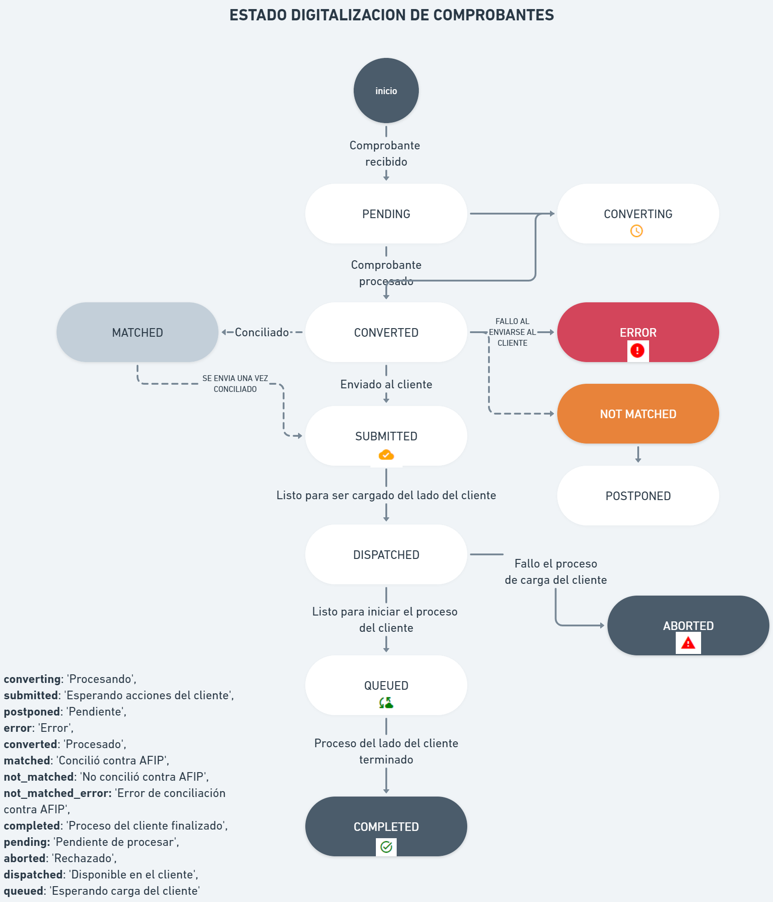

| Estado | Ícono | Descripción |
| -------- | ------- |-------------|
| converting |  | El documento se está procesando |
| submitted |  | Es necesario tomar acciones del lado del cliente en caso de que la conciliación este activada |
| queued |  | Indica que está listo para comenzar el proceso posterior a la digitalización  |
| completed |  | Indica fin del proceso posterior a la digitalización |
| aborted |  | El proceso posterior a la digitalización no se pudo completar |
| error |  | El proceso posterior a la digitalización finalizó con errores |

Estos estados se visualizan desde el reporte de documentos:

En la columna estado:

 

## Caso Práctico
### ¿Cómo hacemos para obtener el estado del procesamiento de un documento que fué enviado a  por e-mail?

El primer paso es acceder al reporte de eMails desde la pantalla de inicio :

 

Se mostrarán los correos procesados, y por cada adjunto descargado, aparecerá un registro: 
 

Las columnas muestran la fecha de recepción del e-mail, el remitente, el asunto, el nombre del adjunto, y el estado del proceso de descarga del adjunto.  

En la sección de acciones se puede descargar el archivo adjunto asociado . En caso de que el documento ya se haya procesado, se podrá visualizar la información obtenida de la digitalización , y además tendrá un acceso directo al documento generado por el proceso , para poder visualizar el estado del ciclo de vida del mismo.
 
 
 
 

Presionando  se puede acceder a la pantalla de proceso del documento “Reporte de Documentos”:
 

De este modo podremos saber el estado de proceso del documento. Notar que se utilizó el filtro para seleccionar el documento en cuestión.
