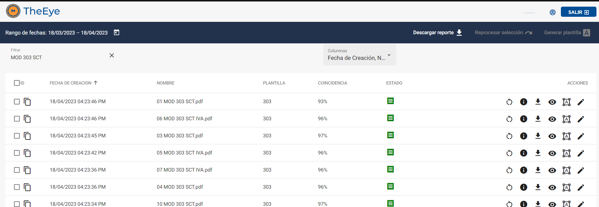
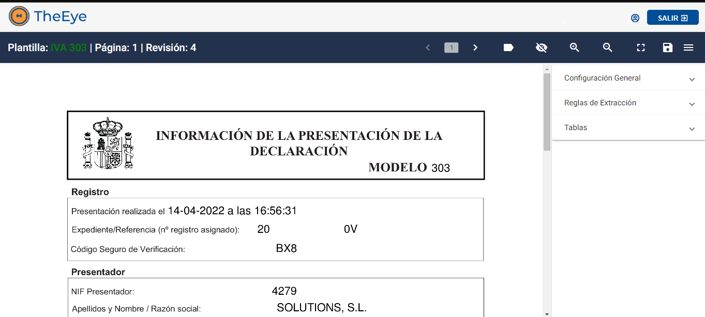
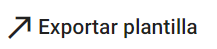
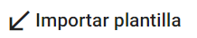
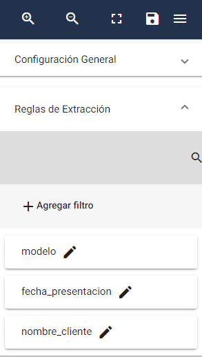
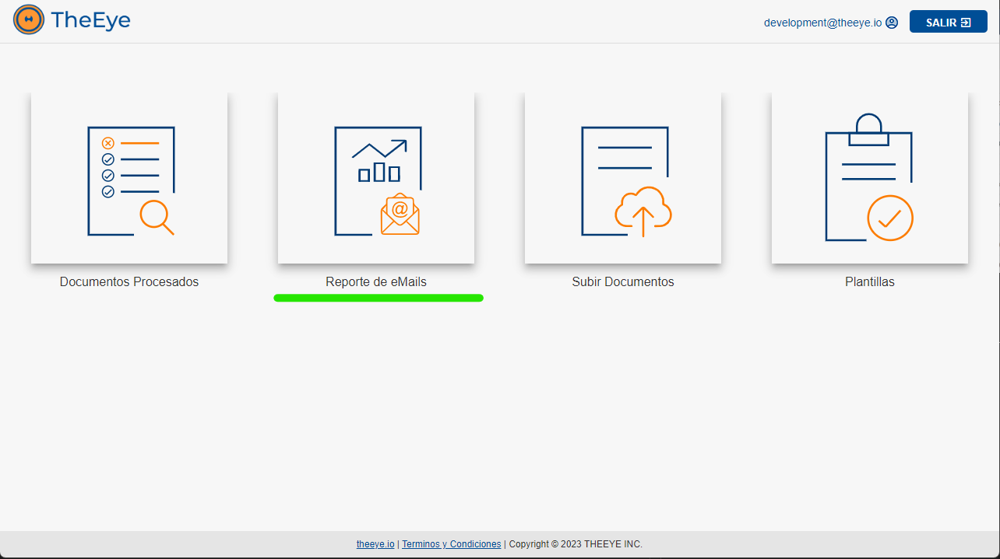
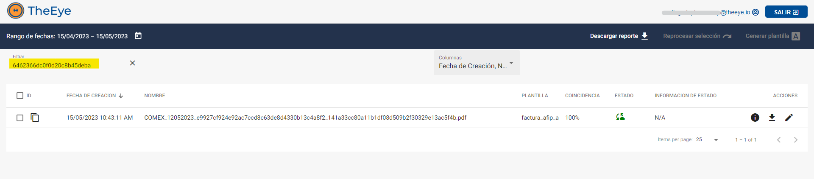

# Digitize - Digitalizador de comprobantes

## Introducción

Reconocimiento de comprobantes de TheEye es una herramienta que permite definir plantillas de reconocimiento de documentos , las cuales son utilizadas para reconocer comprobantes del mismo tipo. Mediante las distintas integraciones es posible trabajar tanto con la obtención de los documentos como con los resultados para utilizarlos en distintos sistemas.

### Funcionalidades y características de Reconocimiento de comprobantes de TheEye

* Permite definir la estructura de los comprobantes cuya información se desea digitalizar, mediante la creación de de plantillas
* Obtención de datos de comprobantes a través de filtros y/o patrones
* Reconocimiento y digitalización de los comprobantes cuya estructura ha sido definida de manera automática y manual
* Capacidad de trabajar con múltiples páginas
* Integraciones
    * Toma de comprobantes desde casillas de correo
    * Envío de comprobantes y resultados vía API
    * conciliación contra AFIP (Argentina)

### Objetivos

Describir cómo crear y utilizar plantillas de reconocimiento de comprobantes 

## Manual de Usuario

El usuario puede generar, gestionar y digitalizar comprobantes desde la web:

**https://digitize.theeye.io/home**

El usuario debe ingresar al formulario con su usuario y contraseña.

### Menú principal 

Una vez logeado el usuario podrá visualizar el siguiente menú principal: 

**Reporte de Documentos**: El usuario puede visualizar el historial de documentos digitalizados y obtener un reporte con los datos obtenidos. Desde esta sección puede también procesar los documentos, visualizar la información obtenida, descargar el documento reconocido y acceder a  modificar la planilla. 

**Reporte de Mails:** En caso de que cuenten con una solución donde los comprobantes son recuperados y descargados desde una casilla de correo el usuario podrá visualizar la información de los e-mails recibidos.

**Subir Documentos:** El usuario puede importar nuevos documentos para digitalizar y/o generar plantillas.

**Plantillas:** El usuario puede visualizar el listado de plantillas “templates” de documentos y modificar las plantillas, así como también puede habilitar o deshabilitar cualquier de ellas.

**Salir:** Cierra la sesión del usuario.

### Reportes de Documentos procesados

Los estados de los documentos se pueden visualizar en la sección de “Reporte de Documentos”

Donde se visualiza el listado de documentos digitalizados.

#### Estados

| Estado | Símbolo | Descripcion | 
|--------|---------|-------------|
| Procesando|  | El proceso de reconocimiento y obtención de datos está en curso.|
| Procesado |  | El proceso de reconocimiento finalizó con éxito. |
| Error |  | El comprobante no pudo ser procesado. |

#### Coincidencias

| Coincidencias | Símbolo de Estado | Descripción |
|---------------|-------------------|-------------|
| **%** |  | Indica el grado de coincidencia obtenido, respecto de la plantilla seleccionada por el proceso de reconocimiento. |

#### Acciones

| Estado | Símbolo | Descripcion | 
|--------|---------|-------------|
| Reprocesar |  | Permite volver a procesar un comprobante ya digitalizado. Se puede utilizar para verificar que se hayan aplicado los cambios realizados en las plantillas. |
| Información obtenida|  | Permite visualizar en pantalla la información reconocida del comprobante importado. |
| Descargar documento |  | Permite descargar el comprobante importado. (formato pdf) |
| Editar plantilla |  | Permite editar plantilla modelo con el formato de comprobante |
| Visualizar plantilla |  | Permite solo ver la plantilla modelo sobre el comprobante procesado |
| Procesar manualmente |  | Permite completar a mano datos faltantes de un comprobante en particular. |

### Plantilla

El listado de plantillas (templates) creados se puede visualizar en la sección “Plantillas”

 

Seleccionar “Activar”  para habilitar o deshabilitar una plantilla

Al seleccionar  se visualiza el editor de la plantilla.

#### Acciones

| Acciones |Símbolo | Descripción |
|----------|--------|-------------|
| Menú de edición |  | Abrir el menú de edición para agregar los filtros y etiquetas del template. Ver ¿Cómo hago para digitalizar un documento? |
| Guardar template |  | Guardar el template asignando un nombre. |
| Quitar etiquetas |  | Visualizar o no las etiquetas creadas. |
| Mostrar información de reconocimiento IA |  | Visualizar o no la información de reconocimiento de IA. |
| Ajuste de pantalla |  | Permite acercar, alejar o ajustar la visualización del documento en pantalla. |

Dentro del menú de edición: 

##### Sección configuración general

| Acciones | Símbolo | Descripción |
| -------- | ------- |-------------|
| Exportar plantilla |  | Permite exportar la plantilla en formato .json |
| Importar plantilla |  | Permite importar una plantilla en formato .json |
| Cambiar nombre |  | Permite cambiar el nombre a la plantilla  |
| Multipágina |  | Habilita el reconocimiento de varias páginas.  Se debe activar para poder digitalizar documentos con N páginas. |
| Eliminar plantilla |  | Permite eliminar de forma permanente la plantilla |
| Definir como plantilla por defecto |  | Permite definir a la plantilla como predeterminada. |

##### Sección reglas de extracción

Permite crear reglas de extracción de datos.

 Ver ¿Como crear una plantilla ?

 

### Reporte de eMails (integración)

### Subir Documentos (integración)

## Trazabilidad

### Flujos de procesamiento de un comprobante

Cuando el ingreso de documentos a digitalizar se realiza mediante un proceso automático, puede ser necesario realizar el segumiento del proceso de digitialización de cada uno de los documentos ingresados.

<!-- tabs:start -->
##### **Correo Electrónico**

Digitize tiene integrada la incorporación de documentos a través de correos electrónicos. 
El flujo responde al siguiente diagrama:

<!-- tabs:end -->

### Ciclo de vida de un documento

Cada documento pasa por distintos estados durante el ciclo de vida del proceso, hasta que o bien termina con su proceso del lado del cliente o es rechazado o abortado por algún error del proceso. En el siguiente diagrama se muestran esos estados que estarán visibles desde las vistas que ofrece Digitize.

#### Estados

| Estado | Ícono | Descripción |
| -------- | ------- |-------------|
| converting |  | El documento se está procesando |
| submitted |  | Es necesario tomar acciones del lado del cliente en caso de que la conciliación este activada |
| queued |  | Indica que está listo para comenzar el proceso posterior a la digitalización  |
| completed |  | Indica fin del proceso posterior a la digitalización |
| aborted |  | El proceso posterior a la digitalización no se pudo completar |
| error |  | El proceso posterior a la digitalización finalizó con errores |

Estos estados se visualizan desde el reporte de documentos:

En la columna estado:

 

### Caso Práctico

#### ¿Cómo hacemos para obtener el estado del procesamiento de un documento que fué enviado a  por e-mail?

El primer paso es acceder al reporte de eMails desde la pantalla de inicio :

 

Se mostrarán los correos procesados, y por cada adjunto descargado, aparecerá un registro: 
 

Las columnas muestran la fecha de recepción del e-mail, el remitente, el asunto, el nombre del adjunto, y el estado del proceso de descarga del adjunto.  

En la sección de acciones se puede descargar el archivo adjunto asociado . En caso de que el documento ya se haya procesado, se podrá visualizar la información obtenida de la digitalización , y además tendrá un acceso directo al documento generado por el proceso , para poder visualizar el estado del ciclo de vida del mismo.
 
 
 
 

Presionando  se puede acceder a la pantalla de proceso del documento “Reporte de Documentos”:
 

De este modo podremos saber el estado de proceso del documento. Notar que se utilizó el filtro para seleccionar el documento en cuestión.
