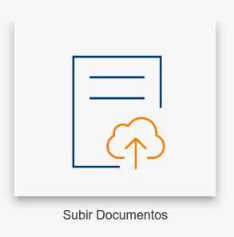

# Cargar comprobantes

Digitize permite automatizar la carga de comprobantes de diversas maneras.

El procesamiento de comprobantes se realiza uno a uno en el orden en que fueron enviados y el resultado es obtenido de forma asincrónico.
Varios factores influyen en el tiempo de procesamiento de los comprobantes.

* Cantidada de página (documentos de 1 pagina o muchas)

* Tamaño del documento (imagenes o pdf de muchas paginas con imagenes)

* Cantidad de información a leer y extraer

* Cantidad de templates

Los documentos se pueden procesar de dos modos

* Tiempo Real

> Los comprobantes procesados en Tiempo Real son procesados de a uno y el resultado se obtiene de la misma forma cuando se termina de procesar.

* Por Lotes / Batch

> Los comprobantes que son procesados en modo Batch pueden tardar un poco mas en devolver el resultado.
Este esquema es elegido cuando los lotes de comprobantes son mayores a 25 comprobantes.
<!-- El sistema devolverá un ID de Lote e informará en cuanto el lote completo termina de ser procesado. -->

La selección del modo de procesamiento se hace de forma automática, varía según la configuración de cada cliente.
También se puede seleccionar al enviar los documentos via API.
  
Una vez que los comprobantes son recibidos por el sistema, se envían a la queue de procesamiento correspondiente.

## Manual

La carga manual se realiza desde el panel de operador utilizar el formulario de carga.

## API

El procesamiento de comprobantes via Api permite automatizar la carga de comprobantes uno a uno siendo enviados desde otro sistema, desde una panel WEB hecho a medida o desde otra interfaz.

Una vez recibidos los comprobantes serán procesados en el orden en que fueron enviados. El progreso y el resultado del procesamiento se puede obtener de distintas maneras <!--como indica en la sección de [Obtención de Resultados](#obtención_de_resultados)-->

<!--[EJEMPLO ACA USANDO PLUGIN DE INSERCION DE CODIGO]()-->

## Mailbot

<!--
## Obtención de Resultados

### Reportes

### Callback

### Consulta via API
-->
