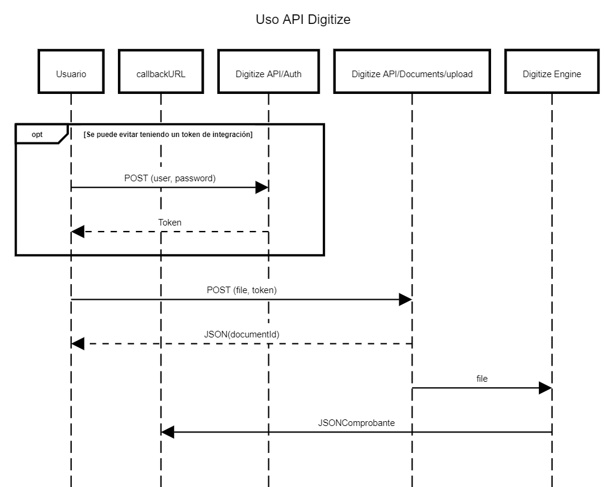

# Documentación API

## Flow de Envío de comprobantes



## Preparación

### Bearer Access Token

Para acceder a la API se debe contar con un AccessToken Bearer.

Para obtenerlo por el momento es solo posible solicitandolo al equipo de Digitai mediante el canal de soporte proporcionado en el momento del alta de su cuenta.

Es posible obtener un AccessToken que se obtiene luego de un login Basic utilizando el usuario y contraseña del panel web.
En caso de no tener un token de acceso de API, el token de acceso obtenido con login Basic sera util para realizar las operaciones que describiremos a continuación.
Tener en cuenta que este token caduca luego de 14 dias, durante ese periodo se mantendra la sesión abierta.
Por lo que no debe ser compartido

<ApiPlaygroundControls />

## Operaciones comunes

<ApiEndpoint
  title="Basic Login"
  method="POST" 
  endpoint="https://digitai-api.theeye.io/api/Session/login"
  :hasBody="true"
  defaultBody='{"username":"user@domain.io","password":"youknowit"}'
>

Este endpoint permite obtener un token de acceso mediante un login básico.

<template #example>

::: code-group
```bash [Curl]
curl -X POST \
       --header 'Content-Type: application/json' \
       --header 'Accept: application/json' \
       -d '{"username":"user%40domain.io","password":"youknowit"}' \
       'https://digitai-api.theeye.io/api/Session/login'
```

```javascript [NodeJS]
const axios = require('axios');

async function login() {
  try {
    const response = await axios.post('https://digitai-api.theeye.io/api/Session/login', {
      username: 'user@domain.io',
      password: 'youknowit'
    }, {
      headers: {
        'Content-Type': 'application/json',
        'Accept': 'application/json'
      }
    });
    
    // Guardar el token para usarlo en solicitudes posteriores
    const accessToken = response.data.id;
    console.log('Access Token:', accessToken);
    return accessToken;
  } catch (error) {
    console.error('Error al iniciar sesión:', error.response?.data || error.message);
  }
}

login();
```
:::

El resultado de esta operación es un access token que se puede utilizar para consultar la API durante un periodo de tiempo especifico


</template>
</ApiEndpoint>

## Operaciones con Lotes (Batch)

<ApiEndpoint
  title="Obtener Todos los Lotes"
  method="GET" 
  endpoint="https://digitai-api.theeye.io/api/Batches"
  :params="[{name: 'access_token', placeholder: 'ElTokenDeAcceso'}]"
>

Este endpoint permite obtener todos los lotes de documentos del cliente.

<template #example>

::: code-group
```bash [Curl]
accessToken="ElTokenDeAcceso"

curl -X GET \
       --header 'Accept: application/json' \
       'https://digitai-api.theeye.io/api/Batches?access_token=${accessToken}'
```

```javascript [NodeJS]
const axios = require('axios');

async function obtenerTodosLosLotes(accessToken) {
  try {
    const response = await axios.get(
      'https://digitai-api.theeye.io/api/Batches', 
      {
        params: {
          access_token: accessToken
        },
        headers: {
          'Accept': 'application/json'
        }
      }
    );
    
    console.log('Todos los lotes:', response.data);
    return response.data;
  } catch (error) {
    console.error('Error al obtener lotes:', error.response?.data || error.message);
  }
}

// Uso
const accessToken = 'ElTokenDeAcceso';
obtenerTodosLosLotes(accessToken);
```
:::

Ejemplo de respuesta:

```json
[
  {
    "customer_id": "60a1b2c3d4e5f6a7b8c9d0e1",
    "name": "Lote de Facturas Enero 2023",
    "creation_date": "2023-06-01T10:15:30.000Z",
    "modification_date": "2023-06-01T10:15:30.000Z",
    "lifecycle": "pending",
    "lifecycle_details": "",
    "import_uuid": "550e8400-e29b-41d4-a716-446655440000",
    "id": "60a1b2c3d4e5f6a7b8c9d0e2",
    "documents_count": 5
  },
  {
    "customer_id": "60a1b2c3d4e5f6a7b8c9d0e1",
    "name": "Lote de Facturas Febrero 2023",
    "creation_date": "2023-07-01T09:10:20.000Z",
    "modification_date": "2023-07-01T09:10:20.000Z",
    "lifecycle": "processed",
    "lifecycle_details": "",
    "import_uuid": "660e8400-e29b-41d4-a716-446655440001",
    "id": "60a1b2c3d4e5f6a7b8c9d0e5",
    "documents_count": 8
  }
]
```

</template>
</ApiEndpoint>

<ApiEndpoint
  title="Crear Batch"
  method="POST" 
  endpoint="https://digitai-api.theeye.io/api/Batches"
  :params="[{name: 'access_token', placeholder: 'ElTokenDeAcceso'}]"
  :hasBody="true"
  defaultBody='{"name":"Lote de Facturas Enero 2023"}'
  :initiallyExpanded="true"
>

Este endpoint permite crear un nuevo lote para agrupar documentos.

<template #example>

::: code-group
```bash [Curl]
accessToken="ElTokenDeAcceso"

curl -X POST \
       --header 'Content-Type: application/json' \
       --header 'Accept: application/json' \
       -d '{"name":"Lote de Facturas Enero 2023"}' \
       'https://digitai-api.theeye.io/api/Batches?access_token=${accessToken}'
```

```javascript [NodeJS]
const axios = require('axios');

async function crearBatch(accessToken) {
  try {
    const response = await axios.post('https://digitai-api.theeye.io/api/Batches', {
      name: 'Lote de Facturas Enero 2023'
    }, {
      params: {
        access_token: accessToken
      },
      headers: {
        'Content-Type': 'application/json',
        'Accept': 'application/json'
      }
    });
    
    console.log('Batch creado:', response.data);
    return response.data;
  } catch (error) {
    console.error('Error al crear batch:', error.response?.data || error.message);
  }
}

// Uso
const accessToken = 'ElTokenDeAcceso';
crearBatch(accessToken);
```
:::

Ejemplo de respuesta:

```json
{
  "customer_id": "60a1b2c3d4e5f6a7b8c9d0e1",
  "name": "Lote de Facturas Enero 2023",
  "creation_date": "2023-06-01T10:15:30.000Z",
  "modification_date": "2023-06-01T10:15:30.000Z",
  "lifecycle": "pending",
  "lifecycle_details": "",
  "import_uuid": "550e8400-e29b-41d4-a716-446655440000",
  "id": "60a1b2c3d4e5f6a7b8c9d0e2"
}
```

</template>
</ApiEndpoint>

<ApiEndpoint
  title="Subir Documentos al Batch"
  method="POST" 
  endpoint="https://digitai-api.theeye.io/api/Batches/:batchId/upload"
  :params="[
    {name: 'batchId', placeholder: '60a1b2c3d4e5f6a7b8c9d0e2'},
    {name: 'access_token', placeholder: 'ElTokenDeAcceso'}
  ]"
  :hasBody="false"
  :hasFileUpload="true"
>

Este endpoint permite subir documentos a un lote específico.

<template #example>

::: code-group
```bash [Curl]
accessToken="ElTokenDeAcceso"
batchId="60a1b2c3d4e5f6a7b8c9d0e2"

curl -X POST \
       'https://digitai-api.theeye.io/api/Batches/${batchId}/upload?access_token=${accessToken}' \
       -F file=@"factura.pdf"
```

```javascript [NodeJS]
const axios = require('axios');
const fs = require('fs');
const FormData = require('form-data');

async function subirDocumentoAlBatch(accessToken, batchId, filePath) {
  try {
    const formData = new FormData();
    const fileStream = fs.createReadStream(filePath);
    formData.append('file', fileStream);
    
    const response = await axios.post(
      `https://digitai-api.theeye.io/api/Batches/${batchId}/upload`, 
      formData, 
      {
        params: {
          access_token: accessToken
        },
        headers: {
          ...formData.getHeaders()
        }
      }
    );
    
    console.log('Documento subido:', response.data);
    return response.data;
  } catch (error) {
    console.error('Error al subir documento:', error.response?.data || error.message);
  }
}

// Uso
const accessToken = 'ElTokenDeAcceso';
const batchId = '60a1b2c3d4e5f6a7b8c9d0e2';
const filePath = './factura.pdf';
subirDocumentoAlBatch(accessToken, batchId, filePath);
```
:::

Ejemplo de respuesta:

```json
{
  "customer_id": "60a1b2c3d4e5f6a7b8c9d0e1",
  "batch_id": "60a1b2c3d4e5f6a7b8c9d0e2",
  "filename": "factura.pdf",
  "original_name": "factura.pdf",
  "creation_date": "2023-06-01T10:20:15.000Z",
  "modification_date": "2023-06-01T10:20:15.000Z",
  "lifecycle": "pending",
  "lifecycle_details": "",
  "id": "60a1b2c3d4e5f6a7b8c9d0e3"
}
```

</template>
</ApiEndpoint>

<ApiEndpoint
  title="Leer Batch por ID"
  method="GET" 
  endpoint="https://digitai-api.theeye.io/api/Batches/:batchId"
  :params="[
    {name: 'batchId', placeholder: '60a1b2c3d4e5f6a7b8c9d0e2'},
    {name: 'access_token', placeholder: 'ElTokenDeAcceso'}
  ]"
>

Este endpoint permite obtener la información de un lote específico.

<template #example>

::: code-group
```bash [Curl]
accessToken="ElTokenDeAcceso"
batchId="60a1b2c3d4e5f6a7b8c9d0e2"

curl -X GET \
       --header 'Accept: application/json' \
       'https://digitai-api.theeye.io/api/Batches/${batchId}?access_token=${accessToken}'
```

```javascript [NodeJS]
const axios = require('axios');

async function obtenerBatchPorId(accessToken, batchId) {
  try {
    const response = await axios.get(
      `https://digitai-api.theeye.io/api/Batches/${batchId}`, 
      {
        params: {
          access_token: accessToken
        },
        headers: {
          'Accept': 'application/json'
        }
      }
    );
    
    console.log('Información del batch:', response.data);
    return response.data;
  } catch (error) {
    console.error('Error al obtener batch:', error.response?.data || error.message);
  }
}

// Uso
const accessToken = 'ElTokenDeAcceso';
const batchId = '60a1b2c3d4e5f6a7b8c9d0e2';
obtenerBatchPorId(accessToken, batchId);
```
:::

Ejemplo de respuesta:

```json
{
  "customer_id": "60a1b2c3d4e5f6a7b8c9d0e1",
  "name": "Lote de Facturas Enero 2023",
  "creation_date": "2023-06-01T10:15:30.000Z",
  "modification_date": "2023-06-01T10:15:30.000Z",
  "lifecycle": "pending",
  "lifecycle_details": "",
  "import_uuid": "550e8400-e29b-41d4-a716-446655440000",
  "id": "60a1b2c3d4e5f6a7b8c9d0e2",
  "documents_count": 5
}
```

</template>
</ApiEndpoint>

## Operaciones con Documentos

<ApiEndpoint
  title="Obtener Todos los Documentos"
  method="GET" 
  endpoint="https://digitai-api.theeye.io/api/Documents"
  :params="[{name: 'access_token', placeholder: 'ElTokenDeAcceso'}]"
>

Este endpoint permite obtener todos los documentos del cliente.

<template #example>

::: code-group
```bash [Curl]
accessToken="ElTokenDeAcceso"

curl -X GET \
       --header 'Accept: application/json' \
       'https://digitai-api.theeye.io/api/Documents?access_token=${accessToken}'
```

```javascript [NodeJS]
const axios = require('axios');

async function obtenerTodosLosDocumentos(accessToken) {
  try {
    const response = await axios.get(
      'https://digitai-api.theeye.io/api/Documents', 
      {
        params: {
          access_token: accessToken
        },
        headers: {
          'Accept': 'application/json'
        }
      }
    );
    
    console.log('Todos los documentos:', response.data);
    return response.data;
  } catch (error) {
    console.error('Error al obtener documentos:', error.response?.data || error.message);
  }
}

// Uso
const accessToken = 'ElTokenDeAcceso';
obtenerTodosLosDocumentos(accessToken);
```
:::

Ejemplo de respuesta:

```json
[
  {
    "customer_id": "60a1b2c3d4e5f6a7b8c9d0e1",
    "batch_id": "60a1b2c3d4e5f6a7b8c9d0e2",
    "filename": "factura1.pdf",
    "original_name": "factura1.pdf",
    "creation_date": "2023-06-01T10:20:15.000Z",
    "lifecycle": "processed",
    "id": "60a1b2c3d4e5f6a7b8c9d0e3"
  },
  {
    "customer_id": "60a1b2c3d4e5f6a7b8c9d0e1",
    "batch_id": "60a1b2c3d4e5f6a7b8c9d0e5",
    "filename": "factura2.pdf",
    "original_name": "factura2.pdf",
    "creation_date": "2023-07-01T09:15:45.000Z",
    "lifecycle": "processed",
    "id": "60a1b2c3d4e5f6a7b8c9d0e4"
  }
]
```

</template>
</ApiEndpoint>

<ApiEndpoint
  title="Leer Documento por ID"
  method="GET" 
  endpoint="https://digitai-api.theeye.io/api/Documents/:documentId"
  :params="[
    {name: 'documentId', placeholder: '60a1b2c3d4e5f6a7b8c9d0e3'},
    {name: 'access_token', placeholder: 'ElTokenDeAcceso'}
  ]"
>

Este endpoint permite obtener la información de un documento específico.

<template #example>

::: code-group
```bash [Curl]
accessToken="ElTokenDeAcceso"
documentId="60a1b2c3d4e5f6a7b8c9d0e3"

curl -X GET \
       --header 'Accept: application/json' \
       'https://digitai-api.theeye.io/api/Documents/${documentId}?access_token=${accessToken}'
```

```javascript [NodeJS]
const axios = require('axios');

async function obtenerDocumentoPorId(accessToken, documentId) {
  try {
    const response = await axios.get(
      `https://digitai-api.theeye.io/api/Documents/${documentId}`, 
      {
        params: {
          access_token: accessToken
        },
        headers: {
          'Accept': 'application/json'
        }
      }
    );
    
    console.log('Información del documento:', response.data);
    return response.data;
  } catch (error) {
    console.error('Error al obtener documento:', error.response?.data || error.message);
  }
}

// Uso
const accessToken = 'ElTokenDeAcceso';
const documentId = '60a1b2c3d4e5f6a7b8c9d0e3';
obtenerDocumentoPorId(accessToken, documentId);
```
:::

Ejemplo de respuesta:

```json
{
  "customer_id": "60a1b2c3d4e5f6a7b8c9d0e1",
  "batch_id": "60a1b2c3d4e5f6a7b8c9d0e2",
  "filename": "factura.pdf",
  "original_name": "factura.pdf",
  "url": "https://storage.digitai.io/documents/60a1b2c3d4e5f6a7b8c9d0e3.pdf",
  "creation_date": "2023-06-01T10:20:15.000Z",
  "modification_date": "2023-06-01T10:20:15.000Z",
  "lifecycle": "processed",
  "tags": [
    {
      "name": "numero_factura",
      "value": "A-0001-00000123",
      "confidence": 0.95
    },
    {
      "name": "fecha",
      "value": "2023-05-20",
      "confidence": 0.98
    }
  ],
  "id": "60a1b2c3d4e5f6a7b8c9d0e3"
}
```

</template>
</ApiEndpoint>

<ApiEndpoint
  title="Obtener Documentos por Batch ID"
  method="GET" 
  endpoint="https://digitai-api.theeye.io/api/Documents"
  :params="[
    {name: 'batch_id', placeholder: '60a1b2c3d4e5f6a7b8c9d0e2'},
    {name: 'access_token', placeholder: 'ElTokenDeAcceso'}
  ]"
>

Este endpoint permite obtener todos los documentos asociados a un lote específico.

<template #example>

::: code-group
```bash [Curl]
accessToken="ElTokenDeAcceso"
batchId="60a1b2c3d4e5f6a7b8c9d0e2"

curl -X GET \
       --header 'Accept: application/json' \
       'https://digitai-api.theeye.io/api/Documents?batch_id=${batchId}&access_token=${accessToken}'
```

```javascript [NodeJS]
const axios = require('axios');

async function obtenerDocumentosPorBatchId(accessToken, batchId) {
  try {
    const response = await axios.get(
      'https://digitai-api.theeye.io/api/Documents', 
      {
        params: {
          batch_id: batchId,
          access_token: accessToken
        },
        headers: {
          'Accept': 'application/json'
        }
      }
    );
    
    console.log('Documentos del batch:', response.data);
    return response.data;
  } catch (error) {
    console.error('Error al obtener documentos del batch:', error.response?.data || error.message);
  }
}

// Uso
const accessToken = 'ElTokenDeAcceso';
const batchId = '60a1b2c3d4e5f6a7b8c9d0e2';
obtenerDocumentosPorBatchId(accessToken, batchId);
```
:::

Ejemplo de respuesta:

```json
[
  {
    "customer_id": "60a1b2c3d4e5f6a7b8c9d0e1",
    "batch_id": "60a1b2c3d4e5f6a7b8c9d0e2",
    "filename": "factura1.pdf",
    "original_name": "factura1.pdf",
    "creation_date": "2023-06-01T10:20:15.000Z",
    "lifecycle": "processed",
    "id": "60a1b2c3d4e5f6a7b8c9d0e3"
  },
  {
    "customer_id": "60a1b2c3d4e5f6a7b8c9d0e1",
    "batch_id": "60a1b2c3d4e5f6a7b8c9d0e2",
    "filename": "factura2.pdf",
    "original_name": "factura2.pdf",
    "creation_date": "2023-06-01T10:25:45.000Z",
    "lifecycle": "processed",
    "id": "60a1b2c3d4e5f6a7b8c9d0e4"
  }
]
```

</template>
</ApiEndpoint>

## Reportes de Documentos

<ApiEndpoint
  title="Obtener Reporte de Documentos por Batch ID"
  method="GET" 
  endpoint="https://digitai-api.theeye.io/api/Documents/report"
  :params="[
    {name: 'filters[batch_id]', placeholder: '60a1b2c3d4e5f6a7b8c9d0e2'},
    {name: 'access_token', placeholder: 'ElTokenDeAcceso'}
  ]"
>

Este endpoint permite obtener un reporte detallado de todos los documentos asociados a un lote específico.

<template #example>

::: code-group
```bash [Curl]
accessToken="ElTokenDeAcceso"
batchId="60a1b2c3d4e5f6a7b8c9d0e2"

curl -X GET \
       --header 'Accept: application/json' \
       'https://digitai-api.theeye.io/api/Documents/report?filters[batch_id]=${batchId}&access_token=${accessToken}'
```

```javascript [NodeJS]
const axios = require('axios');

async function obtenerReportePorBatchId(accessToken, batchId) {
  try {
    const response = await axios.get(
      'https://digitai-api.theeye.io/api/Documents/report', 
      {
        params: {
          'filters[batch_id]': batchId,
          access_token: accessToken
        },
        headers: {
          'Accept': 'application/json'
        }
      }
    );
    
    console.log('Reporte de documentos:', response.data);
    return response.data;
  } catch (error) {
    console.error('Error al obtener reporte:', error.response?.data || error.message);
  }
}

// Uso
const accessToken = 'ElTokenDeAcceso';
const batchId = '60a1b2c3d4e5f6a7b8c9d0e2';
obtenerReportePorBatchId(accessToken, batchId);
```
:::

Ejemplo de respuesta:

```json
[
  {
    "id": "60a1b2c3d4e5f6a7b8c9d0e3",
    "batch_id": "60a1b2c3d4e5f6a7b8c9d0e2",
    "filename": "factura1.pdf",
    "original_name": "factura1.pdf",
    "creation_date": "2023-06-01T10:20:15.000Z",
    "tags": [
      {
        "name": "numero_factura",
        "value": "A-0001-00000123",
        "confidence": 0.95
      },
      {
        "name": "fecha",
        "value": "2023-05-20",
        "confidence": 0.98
      },
      {
        "name": "monto_total",
        "value": "1500.00",
        "confidence": 0.92
      }
    ]
  },
  {
    "id": "60a1b2c3d4e5f6a7b8c9d0e4",
    "batch_id": "60a1b2c3d4e5f6a7b8c9d0e2",
    "filename": "factura2.pdf",
    "original_name": "factura2.pdf",
    "creation_date": "2023-06-01T10:25:45.000Z",
    "tags": [
      {
        "name": "numero_factura",
        "value": "A-0001-00000124",
        "confidence": 0.97
      },
      {
        "name": "fecha",
        "value": "2023-05-22",
        "confidence": 0.99
      },
      {
        "name": "monto_total",
        "value": "2300.50",
        "confidence": 0.94
      }
    ]
  }
]
```

</template>
</ApiEndpoint>

<ApiEndpoint
  title="Enviar documentos a procesar"
  method="POST" 
  endpoint="https://digitai-api.theeye.io/api/documents/upload"
  :params="[
    {name: 'access_token', placeholder: 'ElTokenDeAcceso'}
  ]"
  :hasFileUpload="true"
>

Este endpoint permite enviar documentos a procesar directamente sin un lote.

<template #example>

::: code-group
```bash [Curl]
accessToken="ElTokenDeAcceso"

curl -X POST 'https://digitai-api.theeye.io/api/documents/upload?access_token=${accessToken}' \
       -F file=@"archivocomprobante.pdf"
```

```javascript [NodeJS]
const axios = require('axios');
const fs = require('fs');
const FormData = require('form-data');

async function subirDocumento(accessToken, filePath) {
  try {
    const formData = new FormData();
    const fileStream = fs.createReadStream(filePath);
    formData.append('file', fileStream);
    
    const response = await axios.post(
      'https://digitai-api.theeye.io/api/documents/upload', 
      formData, 
      {
        params: {
          access_token: accessToken
        },
        headers: {
          ...formData.getHeaders()
        }
      }
    );
    
    console.log('Documento subido:', response.data);
    return response.data;
  } catch (error) {
    console.error('Error al subir documento:', error.response?.data || error.message);
  }
}

// Uso
const accessToken = 'ElTokenDeAcceso';
const filePath = './archivocomprobante.pdf';
subirDocumento(accessToken, filePath);
```

```javascript [Node.js]
const FormData = require('form-data')
const path = require('path')
const fs = require('fs')

const https = require('https')
const accessToken = process.env.API_ACCESS_TOKEN

const main = async ([ filepath ]) => {
  const content =  fs.createReadStream(filepath)

  const formData = new FormData()
  formData.append('file', content)

  const request = https.request({
    method: 'post',
    host: 'digitai-api.theeye.io',
    path: `/api/documents/upload?access_token=${accessToken}`,
    headers: formData.getHeaders()
  })

  formData.pipe(request)

  request.on('response', res => {
    const data = []

    res.on('data', chunk => {
      data.push(chunk)
    })

    return new Promise( (resolve, reject) => {
      res.on('end', () => {
        let payload;
        const buffer = Buffer.concat(data).toString()

        // assuming that the response is always JSON.
        // But better would be to check the response content-type header
        //if (/json/.test(res.headers['content-type'])) {
        try {
          payload = JSON.parse(buffer)
        } catch (e) {
          payload = buffer
        }
        //}
        res.body = payload

        if (res.statusCode >= 400) {
          const err = new Error(`${res.statusCode}: ${res.body?.message||res.body}`)
          err.response = res
          err.request = req
          reject(err)
          return
        }

        // return the response object.
        // assign the body to a response property body
        console.log(res.statusCode)
        console.log(res.body)
        resolve(res)
      })
    })
  })

}

main(process.argv.slice(2)).then(console.log).catch(console.error)
```

```python [Python]
import requests
import os
import sys

file = sys.argv[1]
basename = os.path.basename(file)
accessToken = os.getenv('API_ACCESS_TOKEN')

url = "https://digitai-api.theeye.io/api/documents/upload?access_token=" + accessToken

payload = {}
files = [
  ('file', (basename, open(file, 'rb'), 'application/pdf'))
]
headers = {}

response = requests.request("POST", url, headers=headers, data=payload, files=files)

print(response.text)
```
:::

</template>
</ApiEndpoint>

## Instalación de los requisitos

Para ejecutar los ejemplos anteriores necesitas instalar las dependencias:

### Node.js

*Pre-requisitos. Instalar nodejs y npm*

#### Paso 1 (opcional)

Inicializamos el directorio donde colocaremos el script

```bash
npm init -y
```

#### Paso 2

Instalamos las dependencias.
En este ejemplo usamos la libreria https nativa de nodejs y la libreria form-data que nos permite enviar archivos utilizando el header multiparted.


```bash
npm install form-data axios
```

#### Paso 3

Luego podemos guardar el código en un archivo `procesar_documento.js` y ejecutarlo:

```bash
node procesar_documento.js './comprobante.pdf'
```

### Python

*Pre-requisitos. Instalar python y pip*

#### Paso 1

Instalamos la librería request. 

```bash
pip install requests
```

#### Paso 2

Guardamos el código en un archivo `procesar_documento.py` y lo ejecutamos:

```bash
python procesar_documento.py './comprobante.pdf'
```

## Variables de entorno

En el shell debemos setear el access token por variable de entorno para poder comunicarnos con la API.

Linux y macOS:

```bash
export API_ACCESS_TOKEN="ElTokenDeAcceso"
```

Windows:

```shell
set API_ACCESS_TOKEN="ElTokenDeAcceso"
``` 

<ApiPlaygroundControls /> 