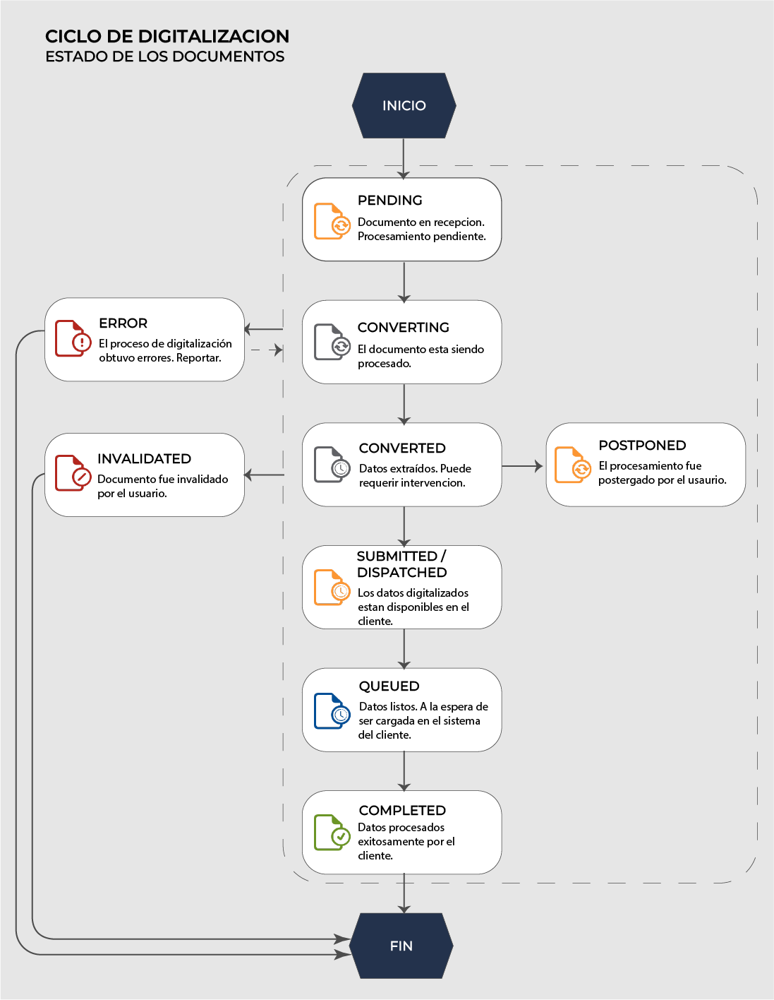

# TheEye Digitize - Digitalización Inteligente de Documentos

## Bienvenidos a la Documentación

TheEye Digitize es una potente herramienta para la automatización del procesamiento y digitalización de documentos. Esta plataforma permite reconocer, extraer y procesar información de diversos tipos de comprobantes y documentos comerciales, integrándola con sus sistemas existentes.

## ¿Qué encontrará en esta documentación?

Esta documentación está organizada para ayudarle a comprender y utilizar todas las funcionalidades de TheEye Digitize:

### [Trazabilidad](/trazabilidad)

Información detallada sobre el ciclo de vida de los documentos en el sistema, desde su recepción hasta su procesamiento final. Aprenda a:

- Monitorear el estado de documentos procesados a través de correo electrónico o API
- Comprender los distintos estados por los que pasa un documento (pendiente, procesando, completado, etc.)
- Utilizar los reportes para seguimiento y auditoría

### [Convenciones](/convenciones/)

Documentación técnica sobre la estructura de datos utilizada en el sistema:

- Diccionario completo de campos para comprobantes de Argentina (AFIP)
- Formatos esperados para cada tipo de dato
- Ejemplos prácticos de respuestas JSON

### [API Reference](/api/)

Documentación completa de nuestra API REST para integrar TheEye Digitize con sus sistemas:

- Autenticación y manejo de tokens
- Endpoints para subir documentos
- Callbacks y notificaciones
- Ejemplos de código en múltiples lenguajes (cURL, Node.js, Python)

Explorador Interactivo

Pruebe nuestra API directamente desde la documentación con nuestro explorador interactivo:

  <a href="/api/" class="custom-button">Ir al Explorador de API</a>

## Primeros Pasos

Para comenzar a utilizar TheEye Digitize:

1. **Acceda a la plataforma**: Ingrese a [https://digitai.theeye.io/home](https://digitai.theeye.io/home) con sus credenciales
2. **Cree plantillas**: Defina la estructura de los documentos que desea procesar
3. **Suba documentos**: Utilice la interfaz web, API o integración con email
4. **Visualice resultados**: Obtenga los datos extraídos en formato JSON

## Integraciones disponibles

TheEye Digitize puede integrarse con múltiples fuentes y destinos:

- **Importación de documentos** desde correo electrónico, API, carpetas compartidas, y más
- **Exportación de datos** mediante API, webhooks, exportación a sistemas ERP, CRM
- **Validación** contra fuentes externas como AFIP (Argentina)

## Soporte

¿Necesita ayuda? Nuestro equipo está disponible para apoyarle en la integración y uso de TheEye Digitize:

- [Portal de Ayuda](https://ayuda.theeye.io)
- Correo: soporte@theeye.io
- Documentación técnica adicional disponible para clientes

 