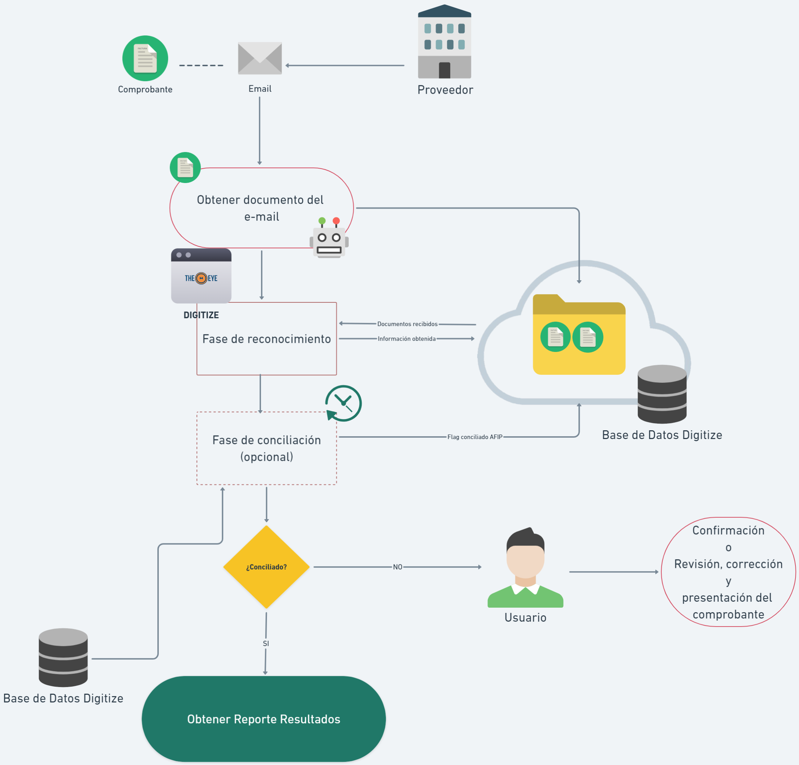
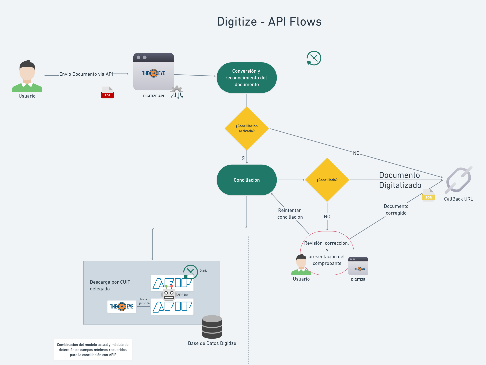
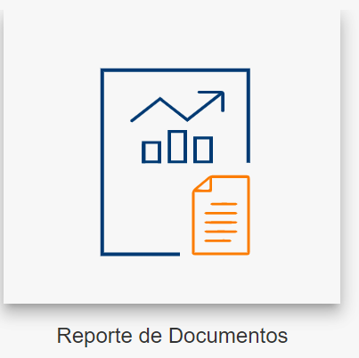
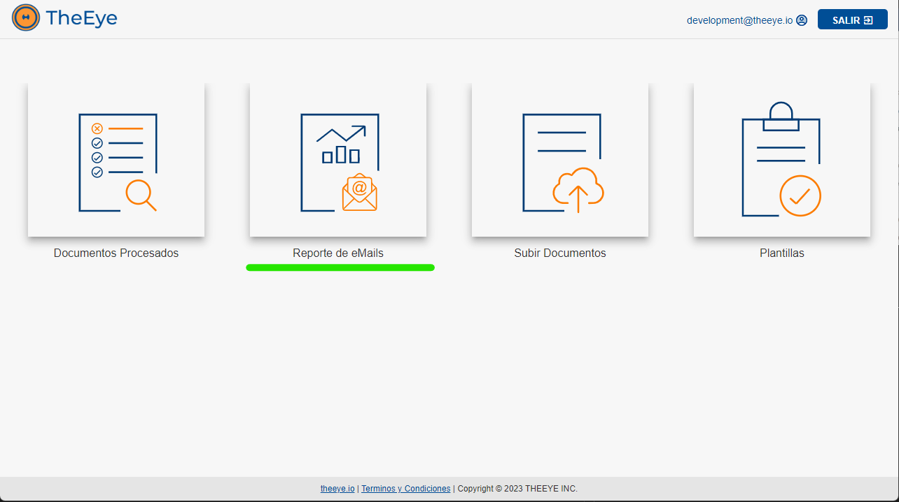
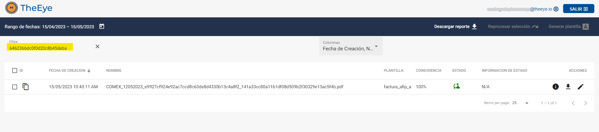

# Trazabilidad

### Flujos de procesamiento de un comprobante

Cuando el ingreso de documentos a digitalizar se realiza mediante un proceso automático, puede ser necesario realizar el seguimiento del proceso de digitalización de cada uno de los documentos ingresados.

#### Correo Electrónico

Digitai tiene integrada la importación de documentos a través de la lectura de casillas de correo electrónico.

El flujo responde al siguiente diagrama:

---

#### API

Digitai tiene una API que permite importar documentos directamente desde otro sistema y la opción de recibir por Webhook la información extraída al finalizar su procesamiento.

El flujo responde al siguiente diagrama:

### Ciclo de vida de un documento

Cada documento pasa por distintos estados durante el ciclo de vida del proceso, hasta que o bien termina con su proceso del lado del cliente o es rechazado o abortado por algún error del proceso. En el siguiente diagrama se muestran esos estados que estarán visibles desde las vistas que ofrece Digitai.

### **Estados**

| Estado            | Detalle                                   | Ícono | Descripción |
|------------------|---------------------------------|----------------|--------------|
| pending         | Pendiente de procesar          |  | Documento en recepción. Pendiente de ser procesado. |
| converting     | Procesando                     |  | El documento está siendo procesado. |
| converted       | Procesado                      |  | Datos extraídos. Puede requerir intervención. |
| imported     | El contenido del archivo ha sido importado |    | Importación finalizada. |
| error          | Error                          |  | El proceso posterior a la digitalización finalizó con errores. Reportar. |
| postponed    | Postergado                           |       | El documento fue postergado para su procesamiento en otro momento. |
| submitted/dispatched       | Entregado al cliente          |  | La información extraída del documento está disponible en el cliente. |
| queued         | Esperando                       |  | Información lista y a la espera de ser cargada en el sistema del cliente. |
| completed      | Proceso del cliente finalizado  |  | La información fue procesada exitosamente por el cliente. |
| invalidated  | Documento invalidado manualmente    |  | El documento fue invalidado manualmente por el usuario. |

Estos estados se visualizan desde el reporte de documentos:

 

### Caso Práctico

#### ¿Cómo obtenemos el estado del procesamiento de un documento que fue enviado por e-mail?

El primer paso es acceder al reporte de emails desde la pantalla de inicio:

 

Se mostrarán los correos procesados, y por cada adjunto descargado, aparecerá un registro.

Las columnas de la tabla presentan la siguiente información:
- Fecha de recepción del e-mail
- Remitente
- Asunto
- Nombre del adjunto
- Estado del proceso de descarga del adjunto

### Acciones disponibles

En la sección de acciones se encuentran las siguientes opciones:

- **Descargar archivo adjunto** : Permite obtener una copia del archivo original adjunto al correo.
- **Visualizar información digitalizada** : Disponible cuando el documento ha sido procesado, muestra los datos extraídos durante la digitalización.
- **Acceder al documento procesado** : Proporciona acceso directo al documento generado, permitiendo visualizar su estado actual en el ciclo de vida del proceso.

Al hacer clic en el icono de acceso al documento procesado , se abrirá la pantalla "Reporte de Documentos" con el documento seleccionado:

Esta vista permite verificar el estado actual del procesamiento del documento. Observe que el sistema utiliza automáticamente el filtro para mostrar únicamente el documento seleccionado. 