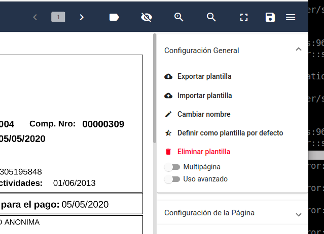
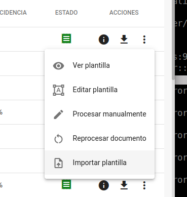
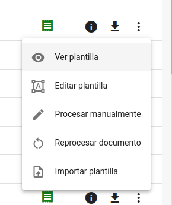
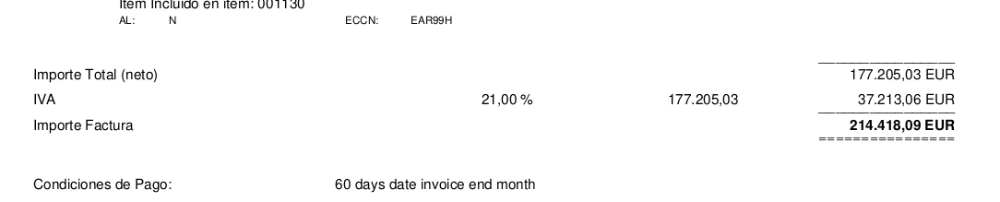

# FAQ: Preguntas Frecuentes

## ¿Cómo ingreso al tagger?
Cada uno de los usuarios registrados, recibirá un correo con un link de acceso directo al documento que debe revisarse.
También se puede acceder de forma directa accediendo a https://tagger-ui.s3.amazonaws.com/index.html

## ¿Cómo obtengo mi usuario de acceso?
Los usuarios son gestionados por TheEye. Consultar el proceso dentro su empresa

## ¿Cómo puedo saber cuantos documentos quedan por revisar?
Cuando se ingresa al sistema, arriba del lado derecho, aparece la cantidad de documentos pendientes de revisión

## ¿Puedo ver el archivo del documento?
En la interfaz, del lado superior izquierdo aparece el nombre del archivo y el link para descargar el documento original, en caso de necesitarlo para revisar error o falta en los datos detectados.

## Veo que a un dato etiquetado le falta un bloque de información. ¿Puedo agregarlo?
Se pueden sumar bloques a un mismo tag, utilizando la tecla CTRL y volviendo a utilizar el mismo nombre del tag. Una vez marcados todos los bloques con CTRL, deben desmarcarse los bloques que quedaron incompletos.

## A veces al querer seleccionar un dato, este aparece en el mismo bloque con otros datos superpuestos. ¿Puedo corregirlo?
Si es posible utilizando las herramientas de edición (mostrar y remover bloques) de la interfaz.

## ¿Qué es un documento inválido?
Los documentos que no pueden ser procesados de forma automática por el sistema, son considerados inválidos. Todos estos casos se presentan para ser ser procesados de forma manual por un operador. Desde el tagger, el operador los puede corregir o terminar de invalidar. Cuando un documento no puede o no debe ser procesado automáticamente se debe invalidar para liberar el documento y continuar con el workflow de rechazo.

Ejemplo de documentos inválidos:

* Documento original con falta de dato importante ( CUIT, CAE, TOTAL, etc)
* Documento no válido para taguer ( remito, recibos, presupuestos, proformas)
* Documento ilegible: Si un documento esta de cabeza o girado el resultado no sería legible y deberá ser enderezado primero para que se pueda procesar correctamente.

## ¿Se puede invalidar un documento?
Si, se debe seleccionar “Invalid” en el combo que se encuentra al lado del botón Presentar.

## ¿Cuales son los campos requeridos para presentar un comprobante?
La interfaz guía al operador para que al momento de presentar un comprobante, el documento contenga todos los tags requeridos y además realiza comprobaciones propias de cada tipo de documento.

DATOS REQUERIDOS
* cae
* cuit jurídica (Destinatario)
* cuit proveedor
* fecha emisión
* fecha cae
* codigo Barra
* tipo documento
* Subtotal gravado, no gravado, exento
* Total
* Iva
* Numero de factura (punto de venta + numero de comprobante)
 

DATOS NO OBLIGATORIOS

* guía
* embarque
* condicion iva
* moneda
* tipo de cambio
* orden de compra
* número de recepción 

VALIDACIONES

ImporteNetogravado, importeNoGravado, ImporteExento
un error común a corregir es un tag mal marcado por error de interpretación. Los valores gravados, no gravados y exentos muchas veces quedan mal marcados por diversos motivos. El sistema valida que sean coherentes de acuerdo al tipo de comprobante, y no le permite al operador avanzar hasta corregirlos.
Por ejemplo:
Si una factura tiene IVA, debe existir un importe Gravado. 
Una factura C no puede tener importe Neto Gravado, deberá corregirse a Importe No Gravado o Exento.

## ¿Puedo editar los valores de los campos taggeados?

Muchas veces hay datos que están bien taggeados, pero les falta o sobra una letra o un número o tienen algún error. Cuando es así se pueden modificar utilizando el lápiz que se encuentra disponible para cada uno de los tags en el panel desplegable lateral. Del mismo modo se puede utilizar la “X” para borrar dicho tag.
Hay casos en los que el mismo sistema filtra los números o letras de mas, si no lo hace proceda como fue indicado antes.

## ¿Puedo agregar un valor que no está presente en el documento (un campo o tag nuevo)?
Si es posible desde el panel desplegable lateral, utilizando el boton “+”, presente por cada Tag.

Esta funcionalidad es muy utilizada para corregir documentos multipágina. En estos casos, se pueden agregar los datos importantes que faltan manualmente (inserción de datos no seleccionables) .

nota: los valores siempre tienen que ir con dos decimales 

## Borré un bloque sin querer ¿Cómo hago para recuperarlo?
En caso de cometer algún error al verificar los datos, ya sea borrar algún bloque sin querer o marcar muchos tags mal, se puede volver al principio recargando la págino o apretando F5.

## ¿Cómo cambiar el documento base de la plantilla?

Para cambiar el documento base de la plantilla hay que exportar y volver a importar la plantilla sobre el nuevo documento base.

El primer paso es exportar la plantilla. con el botón que está en la sección general con la opción Exportar plantilla

El segundo paso es identificar el documento en la pantalla de documentos procesados y haciendo click en el botón de 3 puntitos de la derecha, elegir la última opción del menú desplegable, importar plantilla

Después de hacer esto se deberia borrar o deshabilitar la plantilla anterior, así les queda una sola versión.

Si necesitan por una única vez ver como una plantilla afecta a un documento, pueden visualizarla con el botón del ojo en el menú del documento

## ¿Cuál es la diferencia entre número, moneda e importe? ¿Cuál recomienda usar?

- Número: este filtro recibe un string y remueve todos los símbolos dejando solo números.
- Importe: verifica que el valor sea un importe válido. si es válido lo convierte a un importe con separador decimal punto.
- Moneda: verifica que un texto encontrado se corresponda con un valor de moneda conocido, como puede ser USD, dólar, ARS o peso.

El filtro de importe tiene en cuenta los símbolos separadores de decimales y de miles.
 
## El botón “Validar” pareciera no funcionar correctamente ¿Recomiendan su uso?
 
Si, se puede utilizar. El botón validar aplica reglas de búsqueda y extracción similares a las que aplica el backend.
Puede ser que en algunos casos no esté mostrando correctamente el valor filtrado.
Tengan en cuenta que el resultado obtenido en la interfaz es aproximado y sirve para hacer una verificación aproximada.

Si nos pueden enviar captura del error que detectaron lo revisamos
 
## ¿Cómo funciona la opción “La posición no es fija”?

Esta opción sirve para localizar bloques que no aparecen siempre en el mismo lugar y no se puede usar expresiones regulares.
Por ejemplo, si necesitamos obtener datos al final de una lista de valores que tiene un largo variable.
Según el largo de la lista el dato buscado puede aparecer mas arriba o mas abajo dentro de la página.

En este ejemplo toda la estructura se mueve verticalmente. Puede aparecer al final de la página o al principio de la segunda página.
Ocupa el ancho total, siempre tiene las mismas etiquetas/palabras y los importes van cambiando.
Al buscar Importe Factura, se le puede indicar que no es fijo y lo va a intentar localizar.

Funciona mejor cuando hay datos alrededor del dato buscado. Datos aislados sin mucho detalle es mas difícil de encontrar.