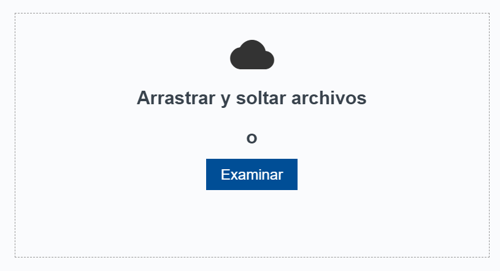
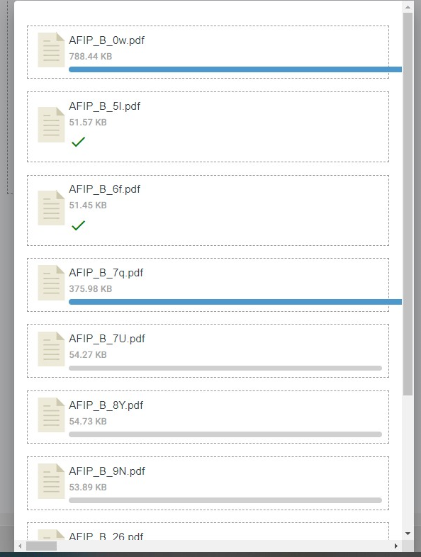

# FAQs - Preguntas frecuentes
## ¿Que es DigitAI?

DigitAI es una plataforma web que permite digitalizar documentos en formato de imagen. 
Extrae los datos por medio de tecnología OCR e IA, y los estandariza para adecuarse a tus necesidades.

DigitAI permite agilizar tu proceso de carga de datos, no solo extrayendo y cargándolos automáticamente, sino también permitiendote gestionar tus comprobantes desde un único lugar. 

## ¿El proceso se adapta al modelo de negocios de mi empresa?

¡Nos adecuamos a tu empresa!
- Podrás cargar comprobantes desde distintas fuentes, como mail o directorios, 
- Podrás solicitar reglas de transformación de datos ad.hoc
- Y los datos de salida generados, serán adecuados a tu sistema contable. 

## ¿Cómo funciona?

La plataforma extrae los datos de los comprobantes mediante reconocimiento de imagen OCR y captura los datos que necesitas utilizando modelos de extracción, que llamamos plantillas.

Solo tendrás que configurar las plantillas por única vez y obtendrás los resultados al ir procesando los comprobantes recibidos automáticamente. 

El sistema está diseñado para que puedas gestionar tus comprobantes en una bandeja de entrada. Es muy fácil visualizar el estado de los comprobantes, y realizar acciones para validar o finalizar el proceso.

## ¿Qué pasa si tengo que gestionar muchos comprobantes con formatos distintos ?

Gracias a la variedad de metodologías de identificación de datos que brinda la plataforma, podrás crear la mejor estrategia para abarcar la mayor cantidad de comprobantes.

- Plantillas con etiquetas para datos simples.
- Plantillas con tablas para listas de datos.
- Plantillas con Expresiones Regulares para datos estructurados.

Una plantilla puede reconocer múltiples comprobantes que posean una estructura similar.

A partir de datos clave, es posible obtener la totalidad de la información, al conciliar contra bases de datos externas (como AFIP)
Así como descartar documentos inválidos o no registrados en AFIP.

Te recomendamos que comiences configurando los comprobantes con mayor volumen. 
Al configurar las plantillas para tus principales proveedores, habrás automatizado la digitalización de al menos el 80% de los comprobantes recibidos. 

## ¿Qué tipos de archivo se pueden procesar?

Cualquier documento de imagen que contenga texto puede ser leído con DigitAI: PNG, JPG, JPEG, TIFF, PDF, tanto de origen digital como escaners.

Se obtienen excelentes resultados con los documentos que mantienen el formato y donde los datos se encuentran ubicados siempre en el mismo lugar.

## ¿Cómo subo los comprobantes ?

Se pueden cargar automáticamente desde una casilla de correo usando nuestro propio Mailbot, desde un repositorio de archivos en la nube (sharepoint, onedrive, aws-s3, google drive, etc), enviando los archivos vía API o subirlos manualmente usando la interfaz web.

Contactanos a support@theeye.io para conectar la plataforma con la casilla de correo o con el directorio.

## ¿Cómo sé que la información extraída es la que yo necesito?

Al configurar las plantillas, puedes establecer los datos obligatorios que necesitas. En caso de que la digitalización no los obtenga, serás notificado cuando haya campos pendientes, y tendrás la opción de incluirlos manualmente. 

La plataforma permite configurar reglas de negocio más avanzadas, en caso de requerirse contactanos a soporte@theeye.io

## ¿Puedo incluir datos que no están en los comprobantes ? 

Se pueden incluir estos campos en las plantillas de extracción o configurar reglas de negocio (tablas maestras) para completarlos automáticamente. 

## ¿Puedo cargar los datos o contabilizar los comprobantes directamente en mi sistema contable ?

Si, podemos integrarnos con tu ERP via API.

Es posible generar CSVs de carga masiva, XMLs o JSONs con información formateada para cumplir tus necesidades de negocio o técnicas.  

Contactanos a support@theeye.io para configurar la integración. 

## ¿Dónde puedo encontrarme con inconvenientes al digitalizar? ¿Qué puedo hacer?

La calidad de los documentos de entrada determina el desempeño de digitalización. 
Los siguientes casos pueden presentar inconvenientes:

- Documentos manuscritos 
- Imágenes escaneadas movidas.
- Documentos torcidos, 
- Documentos que tienen manchas 
- Documentos con áreas no visibles. 

Para sortear estas situaciones, procure mejorar la calidad de los documentos de entrada o complete manualmente los datos faltantes desde la plataforma. 

## ¿Cómo se paga?

Si eres de Argentina, el pago lo puedes realizar por débito automático. Si eres del exterior, el pago se realiza con tarjeta de crédito.Puede adquirirse de forma mensual o anual con 2 meses de regalo. 

## ¿Tienen demo? ¿Tienen trial?

Si, puedo hacer una demo online o puede acceder a un trial de hasta 30 días dependiendo del plan. 

## ¿Tienen API?

Si, la solución se puede consumir via API. Envianos tu consulta a  support@theeye.io  

## ¿Cómo se cobra?

El valor varía por cantidad de comprobantes  y cantidad de usuarios.

## ¿Cómo digitalizar un documento?

Cargar los documentos del mismo tipo en la plataforma del siguiente modo:

Ir a la sección “Subir Documentos”.

Arrastrar o seleccionar los documentos a digitalizar.Se pueden importar varios documentos a la vez.

El progreso de la carga se visualiza a medida que los documentos son cargados:

Una vez cargados los documentos, procedemos a revisar el estado de los documentos.

#### 1- Ir a la sección “Documentos procesados“ para visualizar los documentos cargados

#### 2- Verificar que los documentos se han cargado y reconocido.

Si los documento fueron reconocidos con excitó su estado será  “Procesado”, tendrán asignado una PLANTILLA y un valor de COINCIDENCIA. 

Seleccionando en 
 “Información obtenida “ se pueden visualizar los datos extraidos. 

## ¿Cómo verificar los datos obtenidos por la plantilla creada ?

Dirigirse a la sección "Reporte de documentos" para verificar los resultados de las plantillas creadas, haciendo clic en el ícono de TheEye.

Y luego en:

Luego procesar el documento en cuestión. . 

 

Una vez procesado, se visualiza la plantilla reconocida, el porcentaje de coincidencia y el estado.

Se pueden verificar los resultados (datos obtenidos) haciendo click en el ícono de información 

Verificamos los datos obtenidos:

La información obtenida muestra todos los datos etiquetados y reconocidos de acuerdo a la plantilla aplicada.

## ¿Cómo descargar reportes de documentos ? 

Dirigirse a la sección "Reporte de documentos" para verificar los resultados de las plantillas creadas, haciendo clic en el logo de TheEye.

Y luego en:

Desde la pantalla de reportes, seleccionar un rango de fechas:

Luego hacer clic en 

Se descargará un listado de comprobantes en formato EXCEL, como por ejemplo:

Pueden resultar de interés los campos:
* “**Original_name**”: Nombre de archivo con el que se subió el comprobante.
* “**Classification_label**”: Nombre de la plantilla utilizada
* “**Creation_date**”: Fecha de creación del documento

## ¿Cómo cambiar el documento base de la plantilla?

Para cambiar el documento base de la plantilla hay que exportar y volver a importar la plantilla sobre el nuevo documento base.

El primer paso es exportar la plantilla. Esto se logra con el botón `Exportar plantilla` que se encuentra en la sección general de la pantalla de edición de plantillas.

El segundo paso es identificar el documento en la pantalla de documentos procesados y haciendo click en el botón de 3 puntitos de la derecha, elegir la última opción del menú desplegable, importar plantilla

Después de hacer esto se deberia borrar o deshabilitar la plantilla anterior, así les queda una sola versión.

Si necesitan por una única vez ver como una plantilla afecta a un documento, pueden visualizarla con el botón del ojo en el menú del documento

## ¿Cuál es la diferencia entre los filtros de número, importe y moneda?

- Número: este filtro recibe un string y remueve todos los símbolos dejando solo números.
- Importe: verifica que el valor sea un importe válido. si es válido lo convierte a un importe con separador decimal punto.
- Moneda: verifica que un texto encontrado se corresponda con un valor de moneda conocido, como puede ser USD, dólar, ARS o peso.

El filtro de importe tiene en cuenta los símbolos separadores de decimales y de miles.
 
