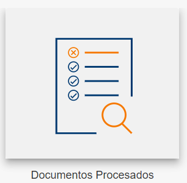
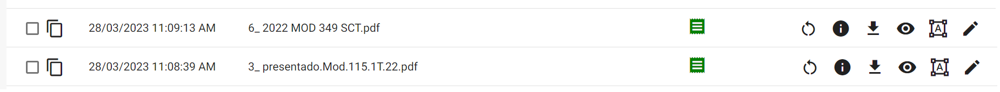
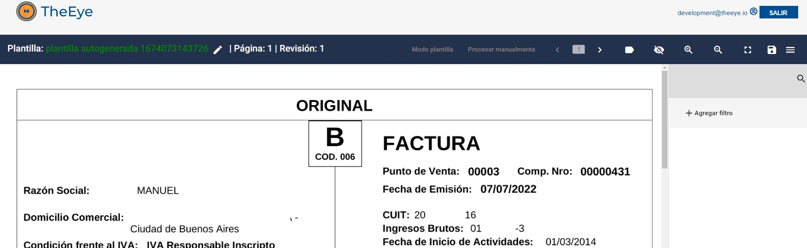
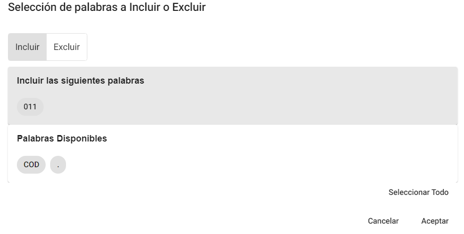
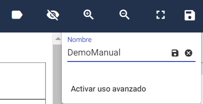
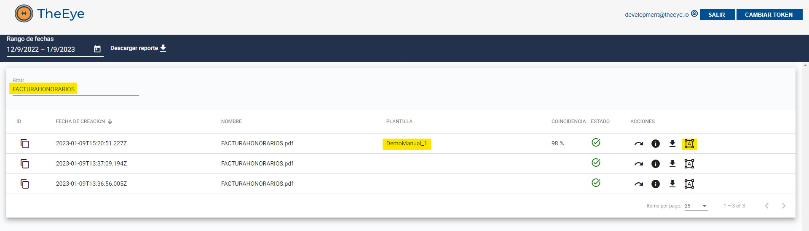

# FAQs - Preguntas frecuentes

## ¿Cómo crear una nueva plantilla?

Para digitalizar un documento lo primero que debemos hacer es crear una plantilla, para ello será necesario contar con varias copias del tipo de documento que deseamos digitalizar.

Se recomienda comenzar con al menos diez copias del mismo tipo de documento, aunque el proceso puede realizarse con menos cantidad. En esta instancia es importante darle un nombre a los archivos que identifique su tipo. En el ejemplo utilizaremos “AFIP_B” como prefijo de todos los nombres de documentos, para indicar que todos ellos son del mismo tipo (estructura).

Lo primero que debemos hacer es es cargar los documentos del mismo tipo en la plataforma del siguiente modo:

Ir a la sección “Subir Documentos”.

Arrastrar o seleccionar los documentos a digitalizar

El progreso de la carga se visualiza a medida que los documentos son cargados:

Una vez cargados los documentos, procedemos a crear una plantilla de clasificación, para ello debemos:

1- Ir a la sección “Documentos procesados“ para visualizar los documentos cargados

2- Verificar que los documentos se han cargado y seleccionarlos.

Notar que el campo “coincidencias” así como también el campo “plantilla” están vacíos,  esto significa que no se pudo reconocer el documento porque no tiene ningún template creado para ese tipo de documento.

Seleccionar los documentos:

3- Generar la  plantilla, haciendo click en “Generar plantilla”

Al darle click a “Generar plantilla” la plataforma creará una plantilla, que servirá para identificar todos los documentos del mismo tipo.

 La plantilla aparecerá en la sección de plantillas con un nombre genérico como por ejemplo “plantilla autogenerada 1674073143726”.

Una vez creada la plantilla autogenerada, deberemos editarla para indicarle los datos a digitalizar y darle un nombre representativo

Ir a plantillas:

Buscar la última generada:

Luego editar la plantilla mediante la acción 

Se visualizará uno de los documentos cargados en “modo plantilla”:

Se recomienda cambiar el nombre utilizando el “lápiz” para dejarle un nombre representativo

Por cada dato de interés se debe crear una etiqueta. Para ello se debe seleccionar el dato encuadrando con el puntero del mouse, tal como se muestra a continuación:

Una vez encuadrado el dato, se le debe dar un nombre  a la etiqueta y luego presionar ”OK”

En el menú derecho se mostrará la nueva etiqueta creada. Se puede editar seleccionando el filtro  desde el menú derecho para establecer configuraciones adicionales.

**Formato:** se le puede indicar el formato de acuerdo al tipo de dato. Por ejemplo, si es un número, importe, fecha o carácter se le aplicará el formato de acuerdo al tipo de dato. 

**Expresión regular:** para los usuarios con conocimiento de programación, se puede escribir una expresión regular para filtrar la información capturada. 

**Define estructura:** Es un dato de clasificación que se utiliza para decidir qué plantilla utilizar en el proceso de reconocimiento. 

**La posición no es fija:** El dato a reconocer puede variar en posición dentro del documento. 

Por ejemplo, los importes totales de un comprobante pueden variar en posición dependiendo de la cantidad de ítems que haya en la descripción o incluso dependiendo de la cantidad de hojas que tiene el documento. 

**Ocurrencia múltiple**: Al marcarla, el proceso de reconocimiento, utilizará el patrón definido en la expresión regular y cada vez que se cumpla, sumará la coincidencia a un listado de valores. En caso de no estar marcado devolverá un único dato con la primera ocurrencia que coincida con el patrón de la expresión regular.

 Borrar: borrar el filtro.

Filtros adicionales:  permite seleccionar las palabras a incluir o excluir al momento de obtener el dato.

Arrastrar las palabras que desea excluir o incluir y seleccionar Aceptar.

**Validar:** permite previsualizar el dato a digitalizar. Al hacer click en Validar, nos mostrará en el documento, el valor seleccionado y en caso de haberle aplicado filtros de formato, el valor formateado

 

Repetir los pasos anteriores para identificar todos los datos a reconocer en el documento. 

Guardar el template armado seleccionando 

Seleccionar guardar.

Asignar un nombre al template.

Al guardar el template correctamente se muestra el mensaje:

Si no se detectaron cambios para guardar se muestra el mensaje: 

En caso de querer capturar datos de páginas siguientes se deberá repetir el procedimiento para las siguientes páginas. Para avanzar o retroceder de página se deben utilizar las flechas 

Cada modificación que se realice en cada una de las páginas debe ser guardada, utilizando la opción de guardar 

## ¿Cómo digitalizar un documento?

cargar los documentos del mismo tipo en la plataforma del siguiente modo:

Ir a la sección “Subir Documentos”.

Arrastrar o seleccionar los documentos a digitalizar.Se pueden importar varios documentos a la vez.

El progreso de la carga se visualiza a medida que los documentos son cargados:

Una vez cargados los documentos, procedemos a revisar el estado de los documentos.

#### 1- Ir a la sección “Documentos procesados“ para visualizar los documentos cargados

#### 2- Verificar que los documentos se han cargado y reconocido.

Si los documento fueron reconocidos con excitó su estado será  “Procesado”, tendrán asignado una PLANTILLA y un valor de COINCIDENCIA. 

Seleccionando en 
 “Información obtenida “ se pueden visualizar los datos extraidos. 

## ¿Cómo verificar los datos obtenidos por la plantilla creada ?

Dirigirse a la sección “Reporte de documentos”  para verificar los resultados de las plantillas creadas, haciendo clic en el ícono de ThEye:

  

Y luego en:

Luego procesar el documento en cuestión. . 

 

Una vez procesado, se visualiza la plantilla reconocida, el porcentaje de coincidencia y el estado.

Se pueden verificar los resultados (datos obtenidos) haciendo click en el ícono de información 

Verificamos los datos obtenidos:

La información obtenida muestra todos los datos etiquetados y reconocidos de acuerdo a la plantilla aplicada.

## ¿Cómo modificar una plantilla existente ?

En caso de que la información obtenida no sea acorde con la información buscada, habrá que modificar la plantilla creada.

Existen 2 formas de acceder a una plantilla existente, ya sea desde la sección de plantillas o desde la sección de “Reporte de documentos”

**Desde la sección de Reporte de Documentos**, podemos ubicar la plantilla utilizando el filtro por documento (con el que se armó la plantilla) o bien con el nombre de la plantilla

Desde la sección de Plantillas, podemos buscar utilizando el filtro con el nombre de la plantilla:

Luego debemos hacer click en el ícono de edición de plantillas 

Nos llevará a la misma pantalla donde creamos la plantilla:

Podemos editar o agregar etiquetas del mismo modo en que se hizo al momento de la creación:

Una vez realizado los cambios, recordar guardar las modificaciones, utilizando el ícono del disco: 

## ¿Cómo modificar la etiqueta de un bloque?

Una vez dentro del modo edición de la plantilla, en el menu reglas de extraccion, seleccionar el lapiz del bloque que a cambiar: 

Cambiar el nombre, seleccionar el tilde 

Guardar el template: 

## ¿Cómo descargar reportes de documentos ? 

Dirigirse a la sección “Reporte de documentos”  para verificar los resultados de las plantillas creadas, haciendo clic en el ícono de TheEye:

  

Y luego en:

Desde la pantalla de reportes, seleccionar un rango de fechas:

Luego hacer clic en 

Se descargará un listado de comprobantes en formato EXCEL, como por ejemplo:

Pueden resultar de interés los campos:
* “**Original_name**”: Nombre de archivo con el que se subió el comprobante.
* “**Classification_label**”: Nombre de la plantilla utilizada
* “**Creation_date**”: Fecha de creación del documento

 
 

