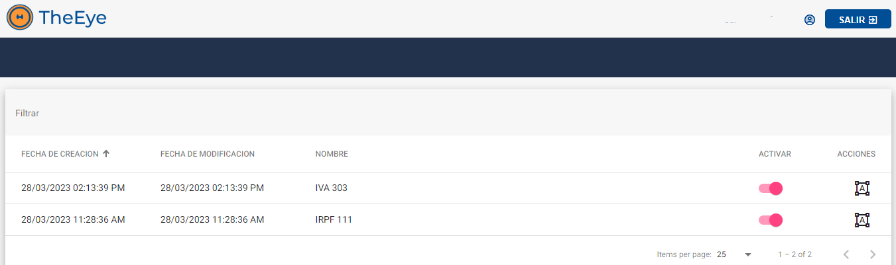

# Digitize - Manual de Usuario

El usuario puede generar, gestionar y digitalizar comprobantes desde la web:

**https://digitize.theeye.io/home**

El usuario debe ingresar al formulario con su usuario y contraseña.

### Menú principal 

Luego del Login el usuario accede al menú principal 

#### **Documentos Procesados**

Desde la sección *Documentos Procesados* se visualiza el historial de documentos digitalizados y obtienen reportes de los datos extraidos.

Las principales acciones

* reprocesar de documentos
* visualizar información obtenida por documento
* descargar los documentos originales enviados
* acceder a la información de la clasificación, plantillas utilizadas y el resultado del reconocimiento
* seleccionar documentos para crear plantillas automáticas

#### **Reporte de Mails**

En caso de que cuenten con la solución de recuperación de comprobantes desde una casilla de correo electrónico puede acceder a la sección *Reporte de Mails* podrá visualizar la información de los correos electrónicos recibidos.
El ícono se encuentra oculto hasta activar la integración de MailBot.

#### **Subir Documentos**

Desde la sección *Subir Documentos* se importan los documentos para digitalizar.
A partir de los documentos importados se generan las plantillas.

#### **Plantillas**

En la sección *Plantillas* puede visualizar el listado de plantillas "templates" disponibles.

Otras acciones disponibles

* editar
* exportar / importar
* activar plantillas

#### **Configuración**

En la sección *Configuración* se accede a parámetros adicionales que modifican el proceso de extración de información de los documentos.

### Documentos Procesados

Los estados de los documentos se pueden visualizar en la sección de “Reporte de Documentos”

Donde se visualiza el listado de documentos digitalizados.

#### Estados

| Estado | Símbolo | Descripcion | 
|--------|---------|-------------|
| Procesando|  | El proceso de reconocimiento y obtención de datos está en curso.|
| Procesado |  | El proceso de reconocimiento finalizó con éxito. |
| Error |  | El comprobante no pudo ser procesado. |

#### Coincidencias

| Coincidencias | Símbolo de Estado | Descripción |
|---------------|-------------------|-------------|
| **%** |  | Indica el grado de coincidencia obtenido, respecto de la plantilla seleccionada por el proceso de reconocimiento. |

#### Acciones

| Estado | Símbolo | Descripcion | 
|--------|---------|-------------|
| Reprocesar |  | Permite volver a procesar un comprobante ya digitalizado. Se puede utilizar para verificar que se hayan aplicado los cambios realizados en las plantillas. |
| Información obtenida|  | Permite visualizar en pantalla la información reconocida del comprobante importado. |
| Descargar documento |  | Permite descargar el comprobante importado. (formato pdf) |
| Editar plantilla |  | Permite editar plantilla modelo con el formato de comprobante |
| Visualizar plantilla |  | Permite solo ver la plantilla modelo sobre el comprobante procesado |
| Procesar manualmente |  | Permite completar a mano datos faltantes de un comprobante en particular. |

### Plantillas

El listado de plantillas (templates) creados se puede visualizar en la sección “Plantillas”

 

Seleccionar “Activar”  para habilitar o deshabilitar una plantilla

Al seleccionar  se visualiza el editor de la plantilla.

#### Acciones

| Acciones |Símbolo | Descripción |
|----------|--------|-------------|
| Menú de edición |  | Abrir el menú de edición para agregar los filtros y etiquetas del template. Ver ¿Cómo hago para digitalizar un documento? |
| Guardar template |  | Guardar el template asignando un nombre. |
| Quitar etiquetas |  | Visualizar o no las etiquetas creadas. |
| Mostrar información de reconocimiento IA |  | Visualizar o no la información de reconocimiento de IA. |
| Ajuste de pantalla |  | Permite acercar, alejar o ajustar la visualización del documento en pantalla. |

Dentro del menú de edición: 

##### Sección configuración general

| Acciones | Símbolo | Descripción |
| -------- | ------- |-------------|
| Exportar plantilla |  | Permite exportar la plantilla en formato .json |
| Importar plantilla |  | Permite importar una plantilla en formato .json |
| Cambiar nombre |  | Permite cambiar el nombre a la plantilla  |
| Multipágina |  | Habilita el reconocimiento de varias páginas.  Se debe activar para poder digitalizar documentos con N páginas. |
| Eliminar plantilla |  | Permite eliminar de forma permanente la plantilla |
| Definir como plantilla por defecto |  | Permite definir a la plantilla como predeterminada. |

##### Sección reglas de extracción

Permite crear reglas de extracción de datos.

 Ver ¿Como crear una plantilla ?

 

### Reporte de eMails (integración)

### Subir Documentos (integración)

