# Digitize - Plantillas

## Creación de plantillas

Para extraer datos de un documento lo primero que debemos hacer es crear una plantilla. Para ello será necesario contar con varias copias del tipo de documento que deseamos digitalizar.

Se recomienda comenzar con al menos cinco copias del mismo tipo de documento, aunque el proceso puede realizarse con menos cantidad. En esta instancia es importante darle un nombre a los archivos que identifique su tipo. En el ejemplo utilizaremos “AFIP_B” como prefijo de todos los nombres de documentos, para indicar que todos ellos son del mismo tipo (estructura).

Si los documentos no están cargados en la plataforma podemos cargarlos manualmente utilizando el modulo de carga de comprobantes manual:

Ir a la sección “Subir Documentos”.

Arrastrar o seleccionar los documentos a digitalizar

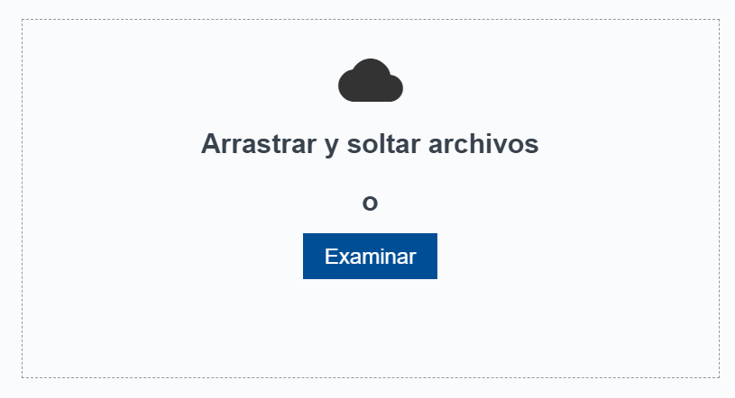

El modulo de carga muestra el progreso a medida que los documentos son recibidos por el sistema:

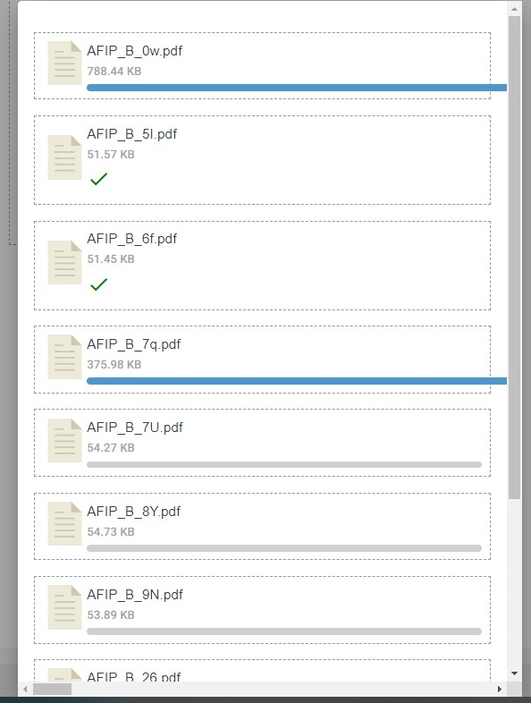

Una vez que los documentos fueron enviados a procesar, procedemos a crear una plantilla de clasificación, para ello debemos:

1- Ir a la sección “Documentos procesados“ para visualizar los documentos cargados

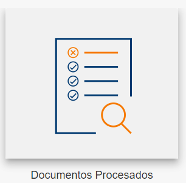

2- Verificar que los documentos fueron procesados correctamente y seleccionarlos.

Notar que el campo **coincidencias** así como también el campo **plantilla** están vacíos,  esto significa que no se pudo reconocer el documento porque no tiene ninuúna plantilla creada para ese tipo de documento.

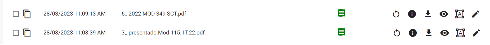

Seleccionar los documentos:

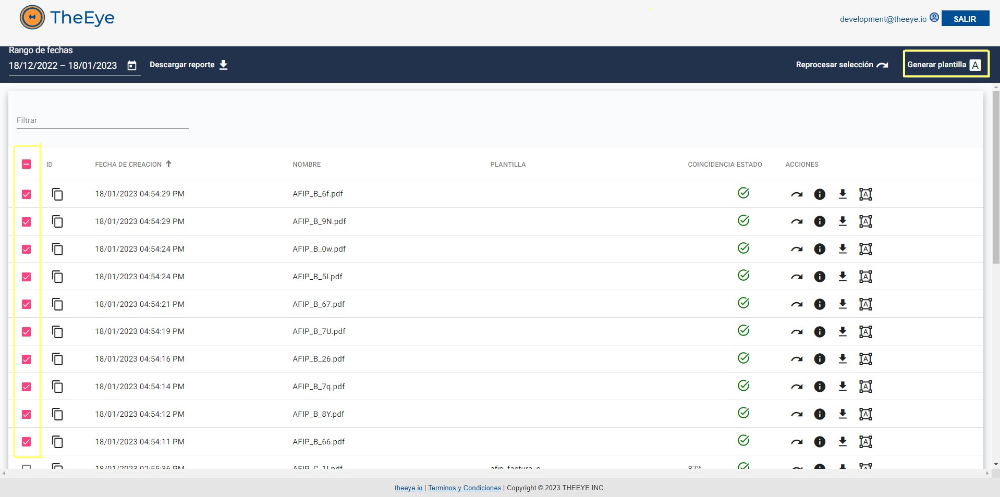

3- Generar la  plantilla, haciendo click en **Generar plantilla**

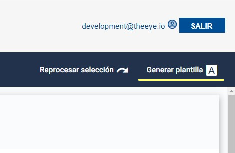

Al darle click a **Generar plantilla** la plataforma creará una plantilla, que servirá para identificar todos los documentos del mismo tipo.

La plantilla aparecerá en la sección de plantillas con un nombre genérico como por ejemplo **plantilla autogenerada 1674073143726**.

Una vez creada la plantilla autogenerada, deberemos editarla para indicarle los datos a digitalizar y darle un nombre representativo

Ir a plantillas:

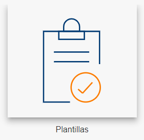

Buscar la última generada:

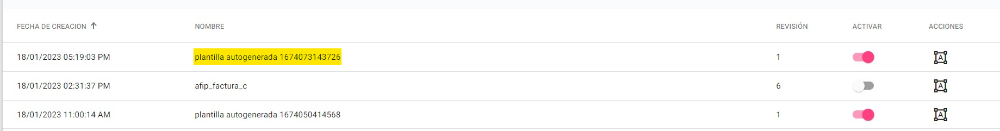

Luego editar la plantilla mediante la acción **Editar**

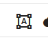

Al editar se visualizará uno de los documentos utilizados para generar la plantilla en **modo plantilla**:

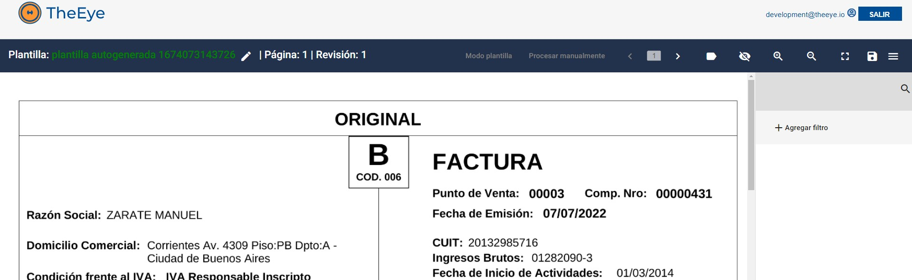

**Importante**:
Notar que en la imagen anterior el panel laterla de **Reglas de Extracción** se encuentra vacío.
En la mayoría de los casos esté no es el escenario habitual y se esperaría encontrar el set de reglas definidas en la plantilla base como se observa en la siguiente imagen

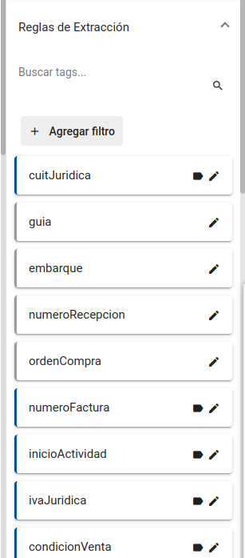

Como primer paso se recomienda cambiar el nombre de la plantilla utilizando el botón de **Cambiar nombre** indicado con un lápiz de la sección 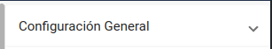. Utilizar un nombre representativo del propósito de la plantilla

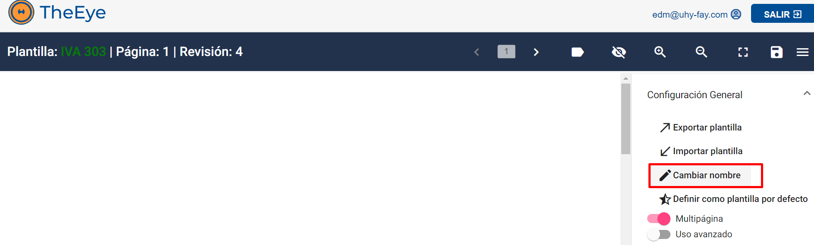

Por cada dato de interés se debe crear una etiqueta. Para ello se debe seleccionar el dato encuadrando con el puntero del mouse, tal como se muestra a continuación:

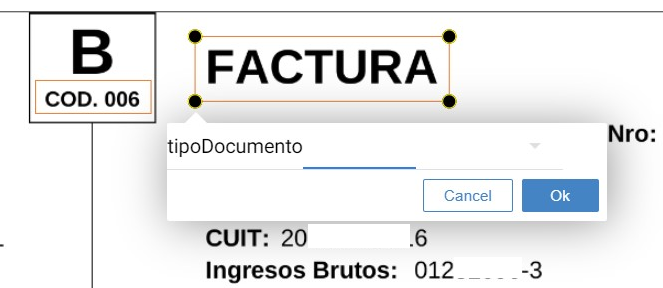

Una vez encuadrado el dato, se le debe dar un nombre  a la etiqueta y luego presionar **OK**

En el menú derecho se mostrará la nueva etiqueta creada. Se puede editar seleccionando el filtro  desde el menú derecho para establecer configuraciones adicionales.

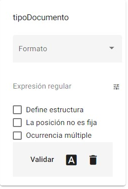

**Formato:** se le puede indicar el formato de acuerdo al tipo de dato. Por ejemplo, si es un número, importe, fecha o carácter se le aplicará el formato de acuerdo al tipo de dato. 

**Expresión regular:** para los usuarios con conocimiento de programación, se puede escribir una expresión regular para filtrar la información capturada. 

**Define estructura:** Es un dato de clasificación que se utiliza para decidir qué plantilla utilizar en el proceso de reconocimiento. 

**La posición no es fija:** El dato a reconocer puede variar en posición dentro del documento. 

Por ejemplo, los importes totales de un comprobante pueden variar en posición dependiendo de la cantidad de ítems que haya en la descripción o incluso dependiendo de la cantidad de hojas que tiene el documento. 

**Ocurrencia múltiple**: Al marcarla, el proceso de reconocimiento, utilizará el patrón definido en la expresión regular y cada vez que se cumpla, sumará la coincidencia a un listado de valores. En caso de no estar marcado devolverá un único dato con la primera ocurrencia que coincida con el patrón de la expresión regular.

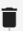 Borrar: borrar el filtro.

Filtros adicionales:  permite seleccionar las palabras a incluir o excluir al momento de obtener el dato.

Arrastrar las palabras que desea excluir o incluir y seleccionar Aceptar.

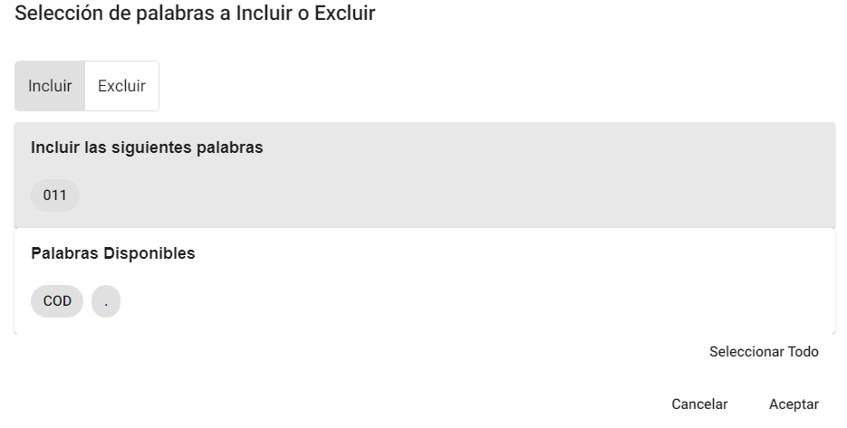

**Validar:** permite previsualizar el dato a digitalizar. Al hacer click en Validar, nos mostrará en el documento, el valor seleccionado y en caso de haberle aplicado filtros de formato, el valor formateado

 

Repetir los pasos anteriores para identificar todos los datos a reconocer en el documento. 

Guardar la plantilla armado seleccionando 

Seleccionar guardar.

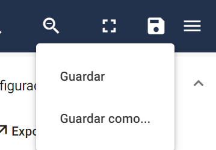

Asignar un nombre a la plantilla.

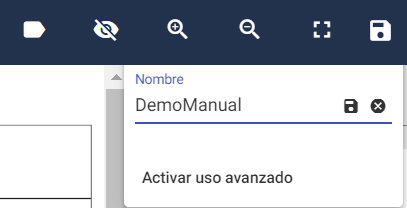

Al guardar la plantilla correctamente se muestra el mensaje:

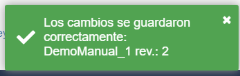

Si no se detectaron cambios para guardar se muestra el mensaje: 

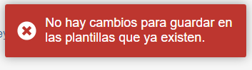

En caso de querer capturar datos de páginas siguientes se deberá repetir el procedimiento para las siguientes páginas. Para avanzar o retroceder de página se deben utilizar las flechas 

Cada modificación que se realice en cada una de las páginas debe ser guardada, utilizando la opción de guardar 

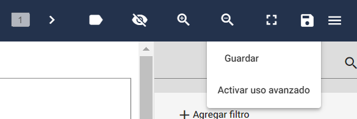

## Modificar una plantilla existente

En caso de que la información obtenida no sea acorde con la información buscada, habrá que modificar la plantilla creada.

Existen 2 formas de acceder a una plantilla existente, ya sea desde la sección de plantillas o desde la sección de “Reporte de documentos”

**Desde la sección de Reporte de Documentos**, podemos ubicar la plantilla utilizando el filtro por documento (con el que se armó la plantilla) o bien con el nombre de la plantilla

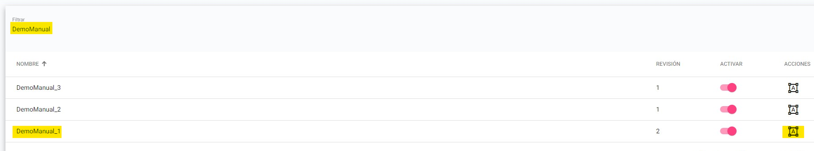

Desde la sección de Plantillas, podemos buscar utilizando el filtro con el nombre de la plantilla:

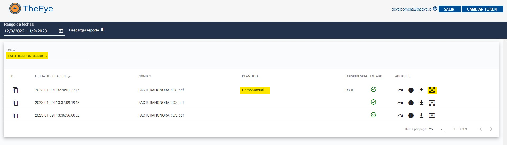

Luego debemos hacer click en el ícono de edición de plantillas 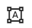

Nos llevará a la misma pantalla donde creamos la plantilla:

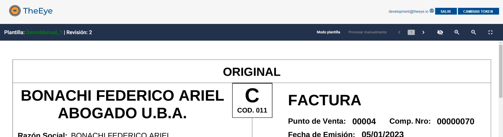

Podemos editar o agregar etiquetas del mismo modo en que se hizo al momento de la creación:

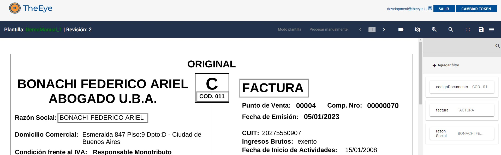

Una vez realizado los cambios, recordar guardar las modificaciones, utilizando el ícono del disco: 

## Clasificación de comprobantes - Coincidencia

Luego de procesar un documento aparecerá visible en la pantalla de Documentos Procesados.
La columna **Coincidencia** muestra el porcentaja utilizado por el sistema para elegir de forma automática la plantilla mas acorde al comprobante procesado.
El porcentaje de **Coincidencia** representa la cantidad de coincidencias de estructura encontradas entre la plantilla y el comprobante.

En caso de no encontrar una plantilla que superer el porcentaje mínimo deseado la columna aparecerá vacía al igual que la columna **Plantilla**.
El porcentaje de **Coincidencia** puede ser ajustado de forma global en la sección *CONFIGURACION* y también puede ser ajustado en cada plantilla individualmente.

Al momento de armar una plantilla nueva usando la opción **Autoplantilla** el sistema calcula y construye la estructura de la plantilla basandose en las estructuras de todos los comprobantes seleccionados.
Cuantos mas documentos se utilicen para armar la plantilla y cuanto mas similares sean entre si estos documentos, mas precisa va a ser la estructura de la plantilla final.

*NOTA*

Las reglas particulares de clasificación de estructura de los template (son las reglas marcadas como **Define estructura** y **Regla condicional**) no se ven reflejadas en el porcentaje de **Coincidencia**.
Estas reglas particulares se aplican luego, y aumentan o disminuyen las chances de usar las plantillas.

## Campo Obligatorio

El check de **campo obligatorio** es utilizado por la interfaz de procesamiento manual de comprobantes para indicar al operador los campos necesarios para poder completar con el procesamiento del documento.
Los campos obligatorios serían los requeridos para su posterior carga en caso de tener una integración con **dispatcher** o envío hacía un sistema remoto, ERP, etc. 

En la sección de trazabilidad se pueden observar los flujos de trabajo asociados a la carga de comprobantes en sistema remotos con intervención manual.

[Flujos de Trabajo](/#/trazabilidad?id=flujos-de-procesamiento-de-un-comprobante/)

El proceso de carga manual se puede utilizar en combinación con los procesos de conciliación y verificación.

El sistema puede ser configurado para frenar el envío del comprobante al sistema de gestión y dejarlo en espera hasta que el usuario tome una acción.

En otros casos el comprobante es enviado al sistema encargado de continuar el proceso de carga inmediatamente después de que se termina de procesar sin pasar por el proceso de verificación manual.
En este caso el chequeo de campo obligatorio no tiene ninguna validez.

## Define Estructura

Cuando ingresa un documento nuevo, el sistema busca una plantilla que mas coincida entre todas las disponibles. A esto le llamamos "clasificación" y da como resultado la plantilla que se va a utilizar para el resto del proceso de extracción.

Cuando usar filtros de *define estructura*

* Los documentos son muy similares entre si, y el proceso de clasificación los confunde y elige la plantilla incorrecta.

* Para diferenciar facturas de diferentes tipos por algún criterio.

* Para identificar rápidamente documentos de un lote

Si se tienen muchos documentos con la misma estructura y se necesita separarlos por proveedor, usaríamos un filtro de *definen estructura* para identificar un texto que siempre se encuentra en los documentos de un proveedor, como por ejemplo la razón social del proveedor o el cuit.

Las reglas de estructura aumentan o disminuyen las posibilidades de usar una plantilla.

### Regla Condicional

Tildando la opción de *Regla condicional* se puede adaptar el filtro para excluir directamente las plantillas durante la clasificación evitando que se usen dando falsos positivos.

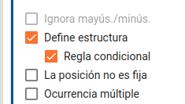

En algunos comprobantes se puede observar que durante la clasificación el porcentaje de coincidencia con las plantillas disponibles da por debajo del 80%, incluso con documentos similares a los que fueron utilizados para armar la plantilla.

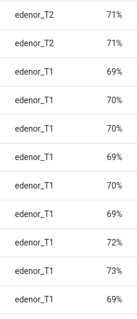

Todas las plantillas son creadas con un porcentaje de aceptación mínimo de 80% por defecto.
Ese valor puede ser modificado en cada plantilla para que esta sea mas o menos permisiva.
El parámetro se puede cambiar entrando al modo edición desde la sección de "configuración de la página" del menu lateral izquierdo.

De esta forma es posible clasificar las facturas según el parámetro de Tarifa usando esta regla.

## Botón **Validar**

El botón validar aplica reglas de búsqueda y extracción similares a las que aplica el backend.
En algunos casos puede no estar mostrando el resultado exactamente igual al que se obtuvo luego del procesamiento automático o incluso ignorar algunos filtros.
Tener en cuenta que el resultado obtenido en la interfaz es aproximado y sirve de referencia para hacer una verificación aproximada.

Con el tiempo lo irémos mejorando hasta igualar el resultado final.
 
## Regla de posición no fija

Esta opción sirve para localizar bloques que no aparecen siempre en el mismo lugar y cuando no es posible usar expresiones regulares.
Por ejemplo, si necesitamos obtener datos al final de una lista de valores que tiene un largo variable.
Según el largo de la lista el dato buscado puede aparecer mas arriba o mas abajo dentro de la página.

En este ejemplo toda la estructura se mueve verticalmente. Puede aparecer al final de la página o al principio de la segunda página.
Ocupa el ancho total, siempre tiene las mismas etiquetas/palabras y los importes van cambiando.
Al buscar Importe Factura, se le puede indicar que no es fijo y lo va a intentar localizar.

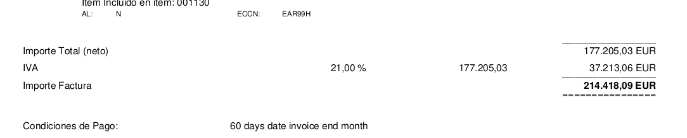

Funciona mejor cuando hay datos alrededor del dato buscado. Datos aislados sin mucho detalle son mas difíciles de encontrar.

## Modificar la etiqueta de un bloque

Una vez dentro del modo edición de la plantilla, en el menu reglas de extraccion, seleccionar el lapiz del bloque que a cambiar: 

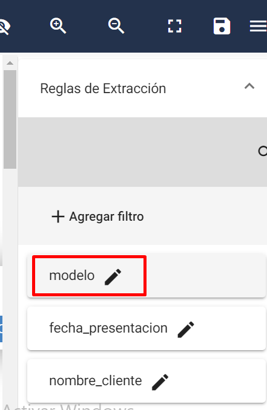

Cambiar el nombre, seleccionar el tilde 

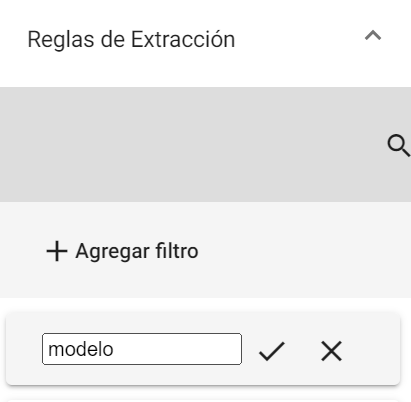

Guardar el template: 

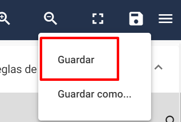

