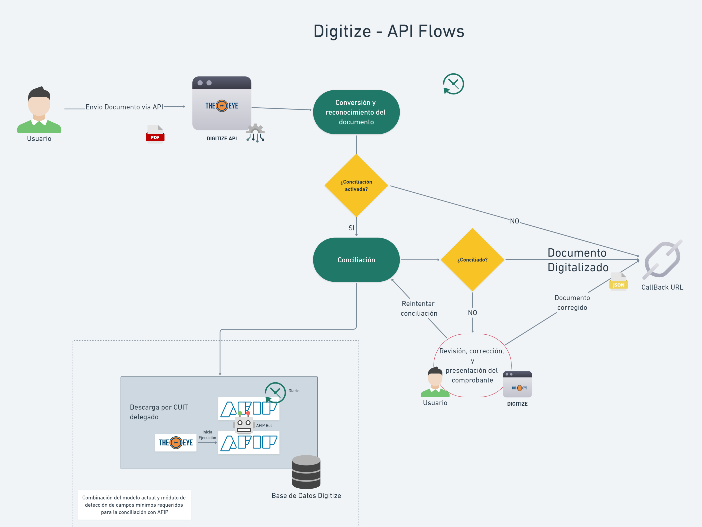

# DigitAI - Trazabilidad

### Flujos de procesamiento de un comprobante

Cuando el ingreso de documentos a digitalizar se realiza mediante un proceso automático, puede ser necesario realizar el segumiento del proceso de digitialización de cada uno de los documentos ingresados.

<!-- tabs:start -->
##### **Correo Electrónico**

Digitize tiene integrada la importación de documentos a través de la lectura de casillas de correo electrónico. 
El flujo responde al siguiente diagrama:

##### **API**

Digitize tiene API que permite importar documentos directamente desde otro sistema y la opción de recibir por Webhook la información extraida al finalizar su procesamiento  
El flujo responde al siguiente diagrama:

<!-- tabs:end -->

### Ciclo de vida de un documento

Cada documento pasa por distintos estados durante el ciclo de vida del proceso, hasta que o bien termina con su proceso del lado del cliente o es rechazado o abortado por algún error del proceso. En el siguiente diagrama se muestran esos estados que estarán visibles desde las vistas que ofrece Digitize.

#### Estados

| Estado | Ícono | Descripción |
| -------- | ------- |-------------|
| converting |  | El documento se está procesando |
| submitted |  | Es necesario tomar acciones del lado del cliente en caso de que la conciliación este activada |
| queued |  | Indica que está listo para comenzar el proceso posterior a la digitalización  |
| completed |  | Indica fin del proceso posterior a la digitalización |
| aborted |  | El proceso posterior a la digitalización no se pudo completar |
| error |  | El proceso posterior a la digitalización finalizó con errores |

Estos estados se visualizan desde el reporte de documentos:

En la columna estado:

 

### Caso Práctico

#### ¿Cómo hacemos para obtener el estado del procesamiento de un documento que fué enviado a  por e-mail?

El primer paso es acceder al reporte de eMails desde la pantalla de inicio :

 

Se mostrarán los correos procesados, y por cada adjunto descargado, aparecerá un registro: 
 

Las columnas muestran la fecha de recepción del e-mail, el remitente, el asunto, el nombre del adjunto, y el estado del proceso de descarga del adjunto.  

En la sección de acciones se puede descargar el archivo adjunto asociado . En caso de que el documento ya se haya procesado, se podrá visualizar la información obtenida de la digitalización , y además tendrá un acceso directo al documento generado por el proceso , para poder visualizar el estado del ciclo de vida del mismo.
 
 
 
 

Presionando  se puede acceder a la pantalla de proceso del documento “Reporte de Documentos”:
 

De este modo podremos saber el estado de proceso del documento. Notar que se utilizó el filtro para seleccionar el documento en cuestión.

