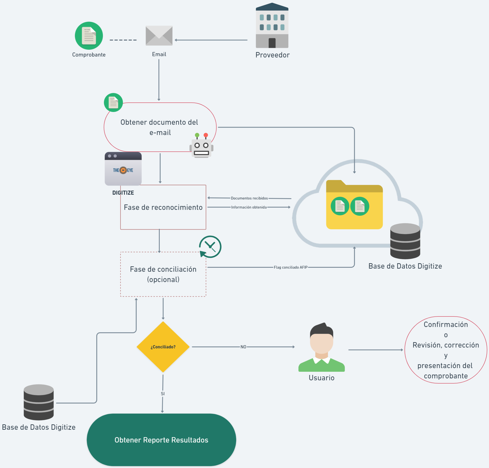
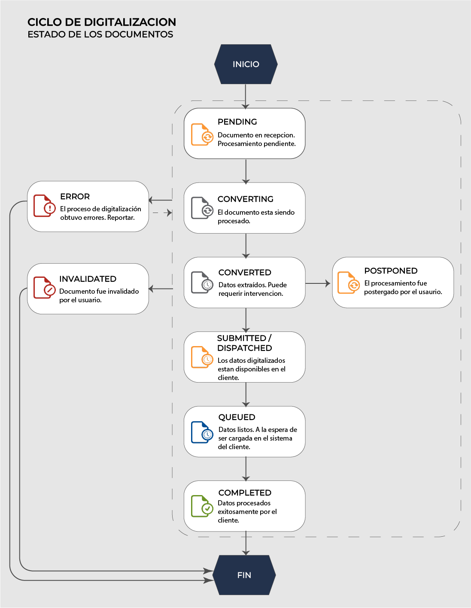
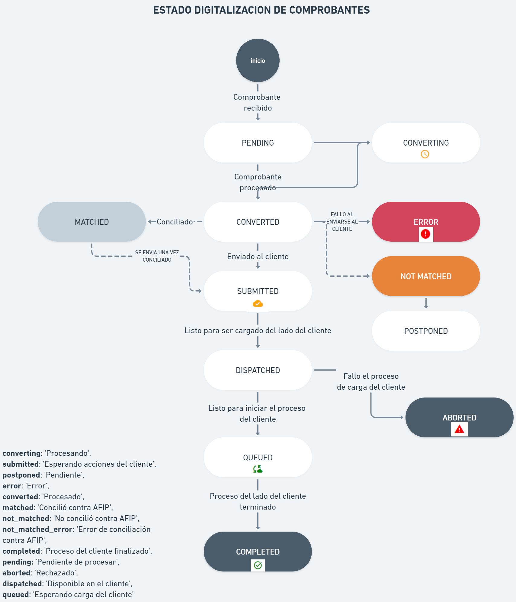
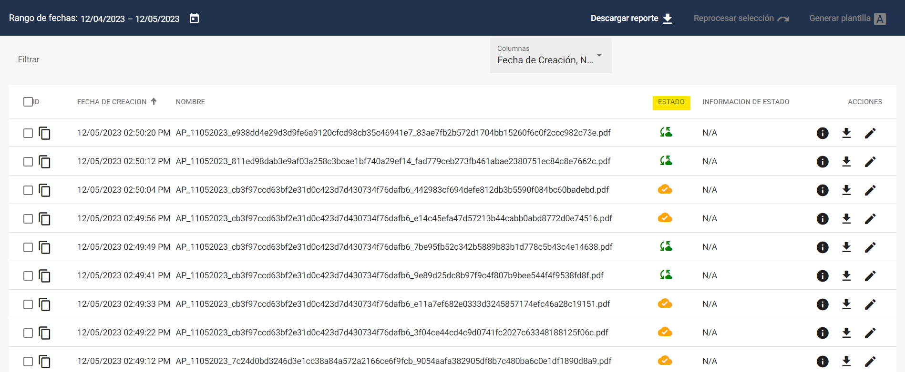
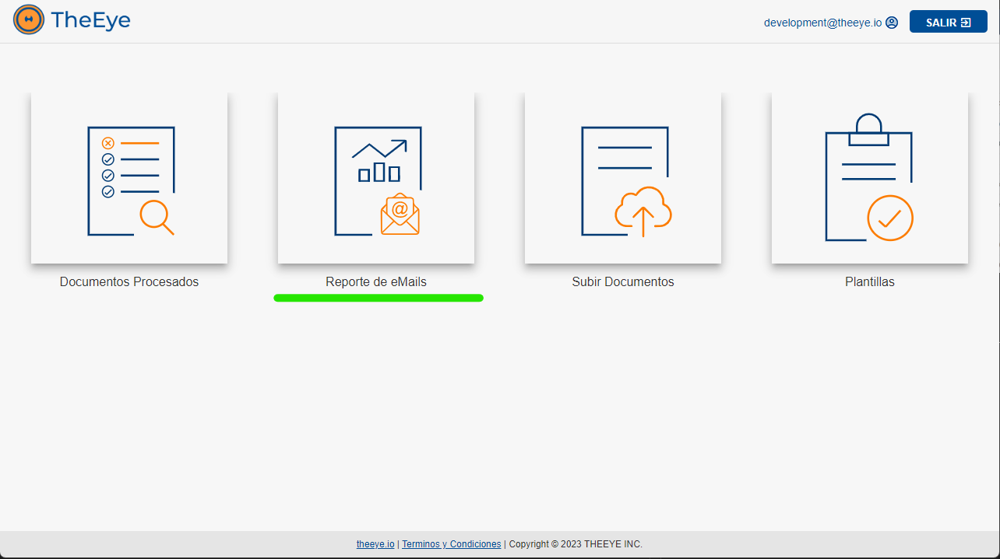
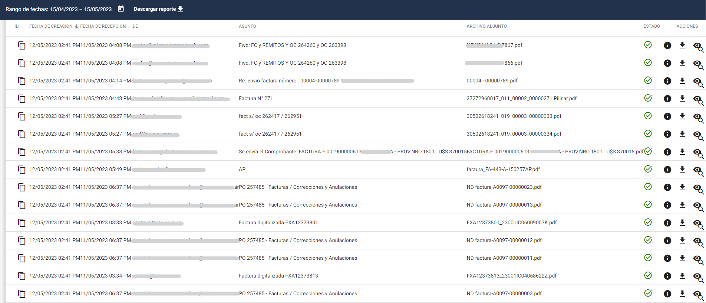
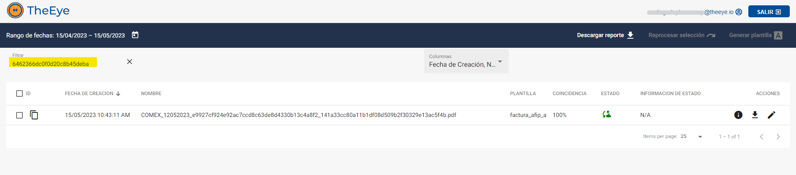

# DigitAI - Trazabilidad

### Flujos de procesamiento de un comprobante

Cuando el ingreso de documentos a digitalizar se realiza mediante un proceso automático, puede ser necesario realizar el seguimiento del proceso de digitalización de cada uno de los documentos ingresados.

<!-- tabs:start -->
##### **Correo Electrónico**

Digitize tiene integrada la importación de documentos a través de la lectura de casillas de correo electrónico. 
El flujo responde al siguiente diagrama:

##### **API**

Digitize tiene una API que permite importar documentos directamente desde otro sistema y la opción de recibir por Webhook la información extraída al finalizar su procesamiento  
El flujo responde al siguiente diagrama:

<!-- tabs:end -->

### Ciclo de vida de un documento

Cada documento pasa por distintos estados durante el ciclo de vida del proceso, hasta que o bien termina con su proceso del lado del cliente o es rechazado o abortado por algún error del proceso. En el siguiente diagrama se muestran esos estados que estarán visibles desde las vistas que ofrece Digitize.

### **Estados**

| Estado            | Detalle                                   | Ícono | Descripción |
|------------------|---------------------------------|----------------|--------------|
| pending         | Pendiente de procesar          |  | Documento en recepción. Pendiente de ser procesado. |
| converting     | Procesando                     |  | El documento está siendo procesado. |
| converted       | Procesado                      |  | Datos extraídos. Puede requerir intervención. |
| imported     | El contenido del archivo ha sido importado |    | Importación finalizada. |
| error          | Error                          |  | El proceso posterior a la digitalización finalizó con errores. Reportar. |
| postponed    | Postergado                           |       | El documento fue postergado para su procesamiento en otro momento. |
| submitted/dispatched       | Entregado al cliente          |  | La información extraída del documento está disponible en el cliente. |
| queued         | Esperando                       |  | Información lista y a la espera de ser cargada en el sistema del cliente. |
| completed      | Proceso del cliente finalizado  |  | La información fue procesada exitosamente por el cliente. |
| invalidated  | Documento invalidado manualmente    |  | El documento fue invalidado manualmente por el usuario. |

Estos estados se visualizan desde el reporte de documentos:

En la columna estado:

 

### Caso Práctico

#### ¿Cómo obtenemos el estado del procesamiento de un documento que fue enviado por e-mail?

El primer paso es acceder al reporte de emails desde la pantalla de inicio :

 

Se mostrarán los correos procesados, y por cada adjunto descargado, aparecerá un registro: 
 

Las columnas muestran la fecha de recepción del e-mail, el remitente, el asunto, el nombre del adjunto, y el estado del proceso de descarga del adjunto.  

En la sección de acciones se puede descargar el archivo adjunto asociado . En caso de que el documento ya se haya procesado, se podrá visualizar la información obtenida de la digitalización , y además tendrá un acceso directo al documento generado por el proceso , para poder visualizar el estado del ciclo de vida del mismo.
 
 
 
 

Presionando  se puede acceder a la pantalla de proceso del documento “Reporte de Documentos”:
 

De este modo podremos saber el estado de proceso del documento. Notar que se utilizó el filtro para seleccionar el documento en cuestión.

